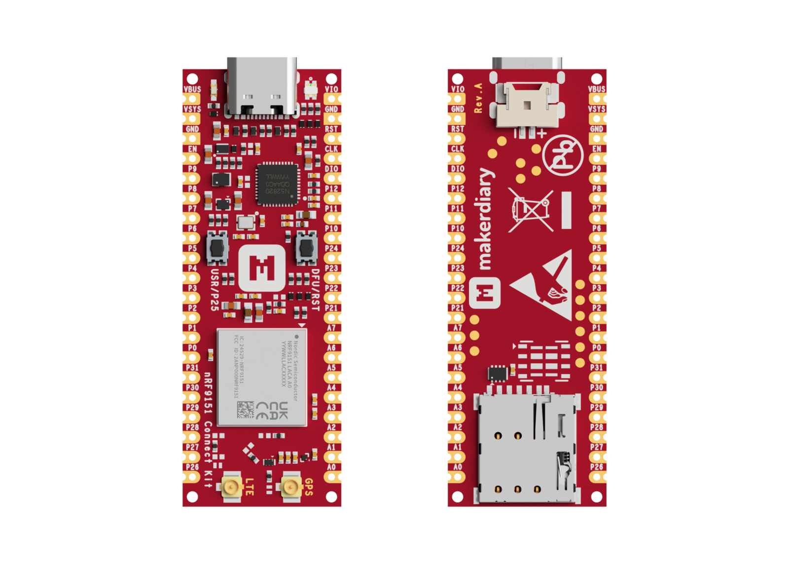
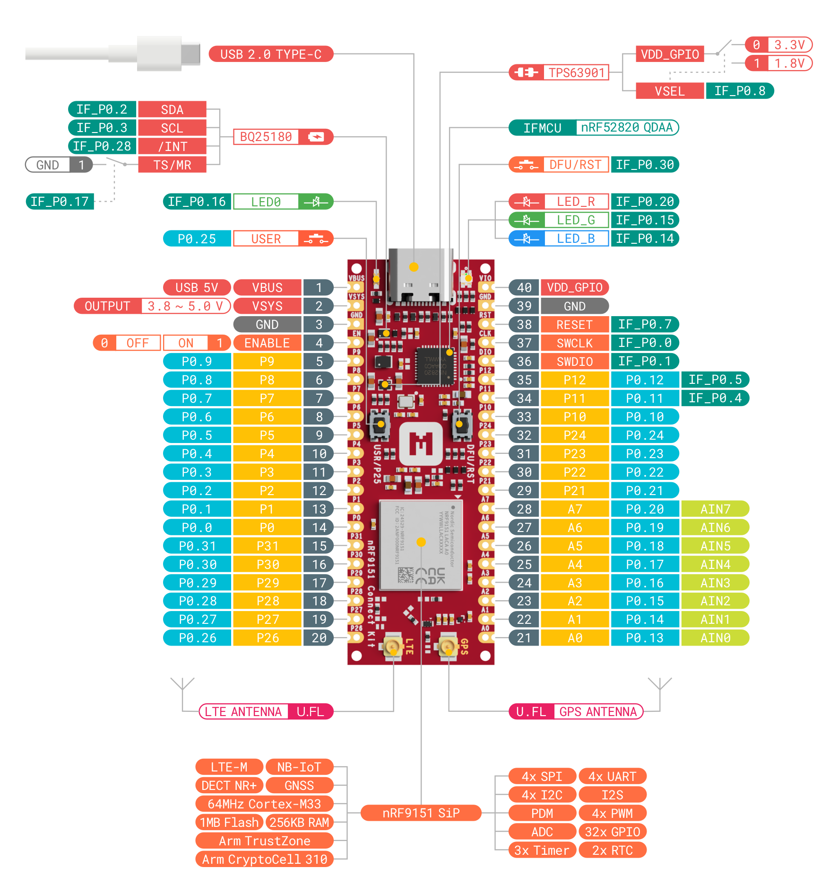
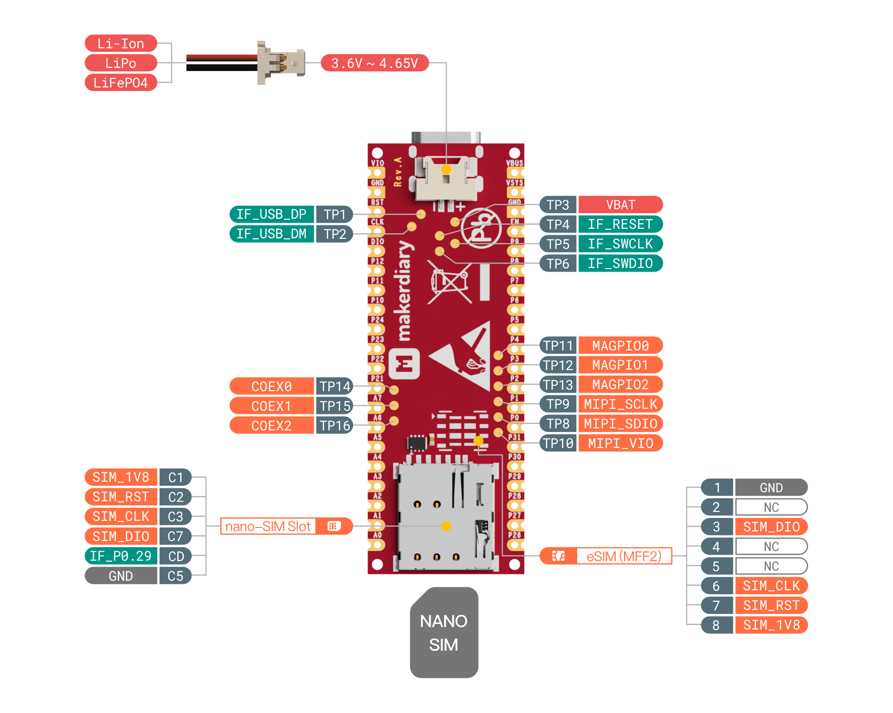

# nRF9151 Connect Kit

> Versatile Prototyping Kit built around the nRF9151 SiP with LTE-M, NB-IoT, GNSS, and DECT NR+

## Introduction

[nRF9151 Connect Kit][nrf9151-connectkit] is a versatile prototyping kit built around the [nRF9151][nrf9151] System-in-Package (SiP) which supports LTE-M, NB-IoT, GNSS, and DECT NR+, making it suitable for global use. It has LTE bands B1-B5, B8, B12, B13, B17-B20, B25, B26, B28, B65, B66 and B85 support, Arm TrustZone CryptoCell 310, unique modem features for further power saving and ease of use.

The design comes with an Interface MCU built using the [nRF52820][nrf52820], which enables debug, programming as well as modem firmware update, no need for any external tools. The Interface MCU also includes a USB-UART bridge for log, trace and terminal emulation, and an Interface Shell bundled with helpful commands to access the board-specific functionality.

The board contains a [BQ25180][bq25180] I2C programmable battery charger with power path management and ultra low quiescent current, and a [TPS63901][tps63901] buck-boost converter with 75-nA quiescent current and 1.8V/3.3V configurable power supply for I/Os.

It also has USB-C, LEDs, Buttons, nano-SIM card slot, Battery connector, U.FL receptacles for U.FL cabled LTE-M/NB-IoT/NR+ and GNSS antennas, Arm Serial Wire Debug (SWD) port and dual-row 40 pins with loose or pre-soldered headers available.

[nRF Connect SDK][ncs] is supported, including the [Zephyr RTOS][zephyr], various samples, networking protocols, libraries, and hardware drivers, all essential for cellular IoT development. It is open source, and can be leveraged and modified to suit your specific needs.

[][nrf9151-connectkit]

## Key Features

* Nordic Semiconductor nRF9151 SiP

	- Fully integrated SiP with 64 MHz Arm Cortex-M33 and multimode LTE-M/NB-IoT modem with
	  DECT NR+ support and GNSS
	- 700-2200 MHz LTE bands: B1-B5, B8, B12, B13, B17-B20, B25, B26, B28, B65, B66, B85
	- Power Class 5 20 dBm
	- Power Class 3 23 dBm
	- 1.9GHz NR+ band support
	- Certified for global operation
	- Dedicated programmable application processor and memory
	- 1 MB Flash + 256 KB RAM
	- Arm TrustZone + Arm CryptoCell 310
	- 4 x SPI/UART/TWI, PDM, I2S, PWM, ADC

* On-board Interface MCU

	- Built using nRF52820 with 64 MHz Arm Cortex-M4, 256 KB Flash & 32 KB RAM
	- Built-in CMSIS-DAP support for debug, programming as well as modem firmware update,
	  no need for any external tools
	- USB-UART bridge for log, trace and terminal emulation
	- Interface Shell with helpful commands to access the board-specific functionality
	- Self-upgradable UF2 Bootloader featuring drag-and-drop programming for Interface MCU firmware update
	- Open source and more features will be released gradually over time

* BQ25180 I2C programmable Battery Charger with power path management and ultra low quiescent current 
* TPS63901 buck-boost converter with 75-nA quiescent current and 1.8V/3.3V configurable power supply for I/Os
* On-board GNSS Low Noise Amplifier (LNA) with 18.2 dB gain and only 0.7 dB noise figure for improved sensitivity
* Shipped with U.FL cabled LTE-M/NB-IoT/NR+ and GNSS antennas
* 31 multi-function GPIOs (8 can be configured as ADC inputs) through edge pins
* Arm Serial Wire Debug (SWD) port through edge pins
* USB-C, LEDs, Buttons, nano-SIM card slot, Battery connector, U.FL receptacles
* Dual-row 40 pins in 55.88mm x 20.32mm (2.2" x 0.8") DIP/SMT form factor
* Available in Loose or Pre-soldered headers options
* Built on open source, supporting nRF Connect SDK and Zephyr RTOS, etc

## Hardware Diagram

The following figure illustrates the nRF9151 Connect Kit hardware diagram. The design is available with loose or pre-soldered pin headers. For more details, refer to the [Hardware description][hw-desc] section.

[][pinout-pdf]

[][pinout-pdf]

## Documentation

We offer a comprehensive set of documentation, including getting started guides, developer guides, and code examples. These resources are designed to reduce development effort and help you achieve faster time-to-market.

* [nRF9151 Connect Kit Documentation][wiki]
* [nRF9151 Connect Kit Product Brief][product-brief]
* [nRF9151 Connect Kit Quick Start Guide][quick-start]
* [Develop with nRF Connect SDK][ncs-guide]
* [nRF9151 Connect Kit Programming Guide][programming]
* [nRF9151 Connect Kit Pinout Rev.A][pinout-pdf]
* [nRF9151 Connect Kit Hardware Description][hw-desc]
* [nRF9151 Connect Kit Schematic Rev.A][schematic]
* [nRF9151 Connect Kit Board DXF Files Rev.A][dxf-files]
* [nRF9151 Connect Kit 3D Model Rev.A][3d-model]

## Where to Buy

nRF9151 Connect Kit is available on the following channels (click to go directly to the product):

## Community Support

Community support is provided via [GitHub Discussions][discussions]. We would love to have more developers contribute to this project! If you're passionate about making this project better, see our [Contributing Guidelines][contributing] for more information.

## License

This project is licensed under the Apache License 2.0 unless otherwise stated. For the full license text, please refer to the [LICENSE](./LICENSE) file.

The nRF Connect SDK and its components are licensed under the 5-Clause Nordic License. See [LICENSE-NORDIC](./LICENSE-NORDIC) for further details.

This project may include some imported or reused components that are licensed under different terms. Please refer to the license files within those components for details.

[nrf9151-connectkit]: https://makerdiary.com/products/nrf9151-connectkit
[nrf9151]: https://www.nordicsemi.com/Products/nRF9151
[nrf52820]: https://www.nordicsemi.com/Products/nrf52820
[bq25180]: https://www.ti.com/product/BQ25180
[tps63901]: https://www.ti.com/product/TPS63901
[ncs]: https://github.com/nrfconnect/sdk-nrf
[zephyr]: https://github.com/zephyrproject-rtos/zephyr
[hw-desc]: https://wiki.makerdiary.com/nrf9151-connectkit/hardware/
[pinout-pdf]: https://wiki.makerdiary.com/nrf9151-connectkit/assets/attachments/nrf9151-connectkit-hardware-diagram_reva.pdf
[wiki]: https://wiki.makerdiary.com/nrf9151-connectkit/
[product-brief]: https://wiki.makerdiary.com/nrf9151-connectkit/introduction/
[quick-start]: https://wiki.makerdiary.com/nrf9151-connectkit/getting-started/
[ncs-guide]: https://wiki.makerdiary.com/nrf9151-connectkit/guides/ncs/
[programming]: https://wiki.makerdiary.com/nrf9151-connectkit/guides/programming/
[schematic]: https://wiki.makerdiary.com/nrf9151-connectkit/assets/attachments/nrf9151-connect-kit-schematic_reva.pdf
[dxf-files]: https://wiki.makerdiary.com/nrf9151-connectkit/assets/attachments/nrf9151-connectkit-board-dxf_reva.zip
[3d-model]: https://wiki.makerdiary.com/nrf9151-connectkit/assets/attachments/nrf9151-connect-kit-3d-model_reva.step
[discussions]: https://github.com/makerdiary/nrf9151-connectkit/discussions
[contributing]: https://github.com/makerdiary/nrf9151-connectkit/contributing/
