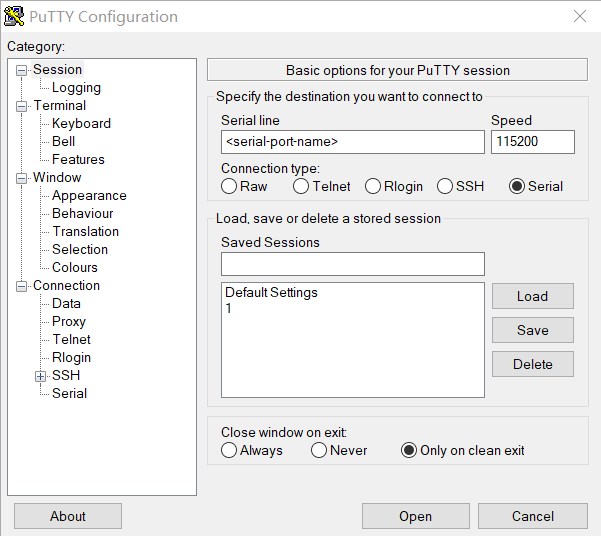

# nRF9151 Connect Kit Quick Start Guide

## Introduction

This quick start guide will navigate you through the process of starting up your new nRF9151 Connect Kit. The board comes pre-programmed with the [Modem Shell] application, enabling you to explore its various features right out of the box.

## Requirements

Before you start, check that you have the required hardware and software:

- 1x [nRF9151 Connect Kit](https://makerdiary.com/products/nrf9151-connectkit)
- 1x nano-SIM card with LTE-M or NB-IoT support
- 1x U.FL cabled LTE-M/NB-IoT/NR+ Flexible Antenna (included in the box)
- 1x U.FL cabled GNSS Antenna (included in the box)
- 1x USB-C Cable
- A computer running macOS, Ubuntu, or Windows 10 or newer

## Set up your board

1. Insert the nano-SIM card into the nano-SIM card slot.
2. Attach the U.FL cabled LTE-M/NB-IoT/NR+ Flexible Antenna.
3. Attach the U.FL cabled GNSS Antenna.
3. Connect the nRF9151 Connect Kit to the computer with a USB-C cable.


## Connect to the Modem Shell

Once the board is connected, it exposes two COM ports, the first one is connected to the Modem Shell whose terminal prompt appears as __`mosh:~$`__.

Open up a serial terminal, specifying the Modem Shell COM port:

=== "Windows"

	1. Start [PuTTY].
	2. Configure the correct serial port and click __Open__:

		

=== "macOS"

	Open up a terminal and run:

	``` bash
	screen <serial-port-name> 115200
	```

=== "Ubuntu"

	Open up a terminal and run:

	``` bash
	screen <serial-port-name> 115200
	```

Press the __DFU/RST__ button to reset the nRF9151 SiP. Observe the output of the terminal. You should see the output, similar to what is shown in the following:

``` { .txt .no-copy linenums="1" title="Terminal" }
All pins have been configured as non-secure
Booting TF-M v2.1.0
[Sec Thread] Secure image initializing!
TF-M isolation level is: 0x00000001
TF-M Float ABI: Hard
Lazy stacking enabled
*** Booting nRF Connect SDK v2.9.99-98a5e50b9ac1 ***
*** Using Zephyr OS v3.7.99-693769a5c735 ***

Reset reason: PIN reset
mosh:~$
MOSH version:       v2.9.99-98a5e50b9ac1
MOSH build id:      custom
MOSH build variant: dev
HW version:         nRF9151 LACA A0A
Modem FW version:   mfw_nrf91x1_2.0.2
Modem FW UUID:      320176d5-9f40-45fc-923b-2661ec18d547


Modem domain event: Light search done
mosh:~$
```

Type ++tab++ to list all supported commands. When you type a command with `--help`, the terminal shows its usage, for example `ping --help`:

``` { .txt .no-copy linenums="21" title="Terminal" }
mosh:~$
  at           clear        cloud_rest   curl         date         device       dl           fota         gnss
  gpio_count   heap         help         history      iperf3       kernel       link         location     ping
  print        rem          resize       rest         retval       shell        sleep        sms          sock
  startup_cmd  th           uart         version
mosh:~$ ping --help
Usage: ping [options] -d destination

  -d, --destination, [str] Name or IP address
Options:
  -t, --timeout, [int]     Ping timeout in milliseconds
  -c, --count, [int]       The number of times to send the ping request
  -i, --interval, [int]    Interval between successive packet transmissions
                           in milliseconds
  -l, --length, [int]      Payload length to be sent
  -I, --cid, [int]         Use this option to bind pinging to specific CID.
                           See link cmd for interfaces
  -6, --ipv6,              Force IPv6 usage with the dual stack interfaces
  -r, --rai                Set RAI options for ping socket. In order to use RAI,
                           it must be enabled with 'link rai' command.
  -h, --help,              Shows this help information
```

## Connect to the LTE network

The Modem Shell application will automatically connect to the LTE network. Wait for the LTE link to be established. You can also type `link status` to show status of the current connection:

``` { .txt .no-copy linenums="42" title="Terminal" }
mosh:~$ link status
Modem functional mode: normal
Network registration status: Connected - home network
Modem config for system mode: LTE-M - NB-IoT - GNSS
Modem config for LTE preference: LTE-M is preferred, but PLMN selection is more important
Currently active system mode: NB-IoT
Battery voltage:       4516 mV
Modem temperature:     25 C
Device ID:             nrf-359404230074347
Operator full name:   ""
Operator short name:  ""
Operator PLMN:        "46000"
Current cell id:       213818780 (0x0CBE9D9C)
Current phy cell id:   352
Current band:          8
Current TAC:           7464 (0x1D28)
Current rsrp:          55: -86dBm
Current snr:           26: 2dB
Mobile network time and date: 25/02/16,05:25:35+32
PDP context info 1:
  CID:                0
  PDN ID:             0
  PDP context active: yes
  PDP type:           IP
  APN:                cmnbiot
  IPv4 MTU:           1280
  IPv4 address:       100.25.164.39
  IPv6 address:       ::
  IPv4 DNS address:   120.196.165.7, 221.179.38.7
  IPv6 DNS address:   ::, ::
```

Use `ping` command to test the reachability of a host on an IP network. For example:

``` bash
ping -d makerdiary.com	# (1)!
```

1.  
	``` { .txt .no-copy linenums="1" title="Terminal" }
	mosh:~$ ping -d makerdiary.com
	Initiating ping to: makerdiary.com
	Modem domain event: CE-level 0
	RRC mode: Connected
	Source IP addr: 100.19.132.199
	Destination IP addr: 23.227.38.32
	Pinging makerdiary.com results: time=0.316secs, payload sent: 0, payload received 0
	Pinging makerdiary.com results: time=0.927secs, payload sent: 0, payload received 0
	Pinging makerdiary.com results: time=0.912secs, payload sent: 0, payload received 0
	Pinging makerdiary.com results: time=0.907secs, payload sent: 0, payload received 0
	Ping statistics for makerdiary.com:
		Packets: Sent = 4, Received = 4, Lost = 0 (0% loss)
	Approximate round trip times in milli-seconds:
		Minimum = 316ms, Maximum = 927ms, Average = 765ms
	Pinging DONE
	```

## Explore the GNSS functionality

The Modem Shell application provides commands to explore the GNSS functionality.

Use `gnss` command to start the GNSS:

``` bash
gnss start
```

For best results retrieving GNSS data, place the board outside with a clear view of the sky. Observe that the following information is displayed upon acquiring a fix:

``` { .txt .no-copy linenums="1" title="Terminal" }
Fix valid:          true
Leap second valid:  false
Sleep between PVT:  false
Deadline missed:    false
Insuf. time window: false
Velocity valid:     true
Scheduled download: false
Execution time:     52587 ms
Time:              22.02.2025 07:29:24.141
Latitude:          22.694009
Longitude:         113.941902
Accuracy:          3.5 m
Altitude:          103.4 m
Altitude accuracy: 5.5 m
Speed:             0.1 m/s
Speed accuracy:    0.6 m/s
V. speed:          0.2 m/s
V. speed accuracy: 0.6 m/s
Heading:           0.0 deg
Heading accuracy:  180.0 deg
PDOP:              4.6
HDOP:              2.6
VDOP:              3.7
TDOP:              3.4
Google maps URL:   https://maps.google.com/?q=22.694009,113.941902
SV:  22 C/N0: 38.7 el: 42 az: 331 signal: 1 in fix: 1 unhealthy: 0
SV:  17 C/N0: 37.7 el: 43 az: 325 signal: 1 in fix: 1 unhealthy: 0
SV:  14 C/N0: 39.7 el: 63 az: 342 signal: 1 in fix: 1 unhealthy: 0
SV: 195 C/N0: 40.2 el: 63 az:  55 signal: 3 in fix: 1 unhealthy: 0
SV: 194 C/N0: 38.9 el: 61 az:  92 signal: 3 in fix: 1 unhealthy: 0
SV:   1 C/N0: 40.1 el: 37 az:  35 signal: 1 in fix: 1 unhealthy: 0
SV:   3 C/N0: 32.6 el: 40 az:  97 signal: 1 in fix: 1 unhealthy: 0
SV: 199 C/N0: 31.3 el:  0 az:   0 signal: 3 in fix: 0 unhealthy: 0
SV:  19 C/N0: 24.5 el:  0 az:   0 signal: 1 in fix: 0 unhealthy: 0
...
```

To turn off the GNSS, run the following command:

``` bash
gnss stop
```

!!! Tip "Optimize GNSS reception"

	* GNSS signals do not usually penetrate ceilings or other structures that well. For best GNSS performance, the antenna should be placed outside on a flat surface in an open space far from sources of interference and other structures that can block the satellite signals.
	* The GNSS patch antenna achieves the highest gain when placed horizontally on a surface (x-y) facing the z-axis since it can receive all propagated GNSS signals. A lower gain is experienced if the patch antenna is mounted at an angle.

## Next steps

Congratulations! You've completed the quick start guide and explored some features of the Out-of-Box application. There is much more to explore. Check out our developer guides:

<div class="grid cards" markdown>

-   [Develop with nRF Connect SDK](./guides/ncs/index.md)

-   [Programming Guide](./guides/programming/index.md)

</div>

[Modem Shell]: ./guides/ncs/applications/modem_shell.md
[PuTTY]: https://apps.microsoft.com/store/detail/putty/XPFNZKSKLBP7RJ
