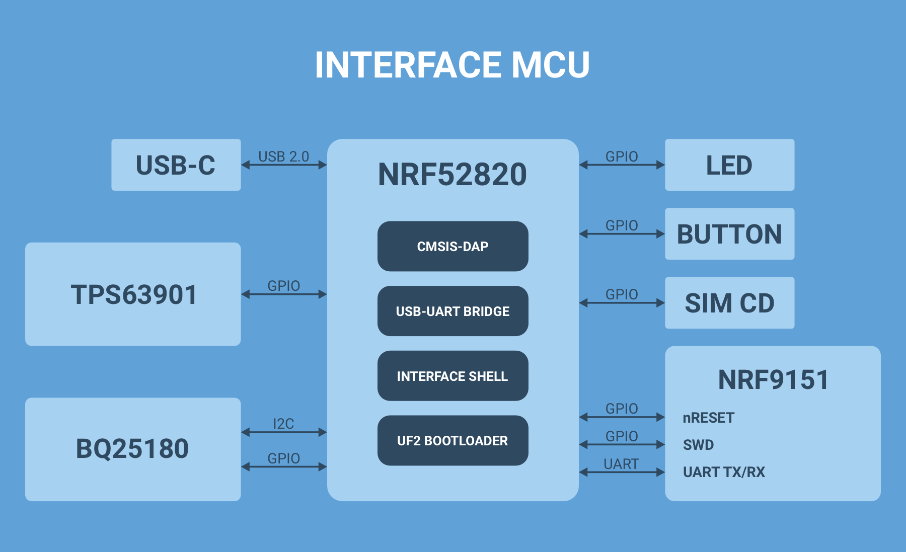
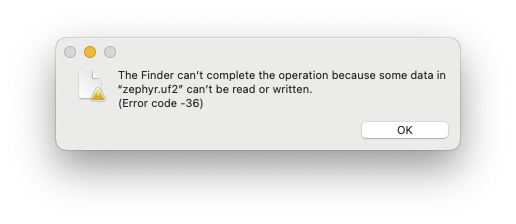

# Interface MCU Firmware

## Overview

This guide walks you through building and running the Interface MCU Firmware which enables a CMSIS-DAP interface for debug and programming, a USB-UART bridge for terminal emulation and an Interface Shell for accessing board-specific functionality.

## How it works

The nRF9151 Connect Kit comes with an on-board Interface MCU built using the nRF52820. The Interface MCU Firmware is running on the nRF52820. It implements a CMSIS-DAP interface for debugging and programming the nRF9151 SiP. It also exposes two USB CDC ACM devices, one acts as a UART bridge between the host and the nRF9151 SiP, the other enables an Interface Shell for accessing board-specific functionality such as battery charger settings.

The Interface MCU also comes pre-programmed with the [UF2 Bootloader], an easy-to-use and self-upgradable bootloader that can be used to update the firmware by just copying the .uf2-format images to the flash drive without using an external programmer.

The following figure describes the functional architecture of the Interface MCU:




## Requirements

Before you start buiding the application, check that you have the required hardware and software:

- 1x [nRF9151 Connect Kit](https://makerdiary.com/products/nrf9151-connectkit)
- 1x USB-C Cable
- A computer running macOS, Ubuntu, or Windows 10 or newer

## Building the application

To build the application, follow the instructions in [Getting Started Guide] to set up your preferred building environment.

Use the following steps to build the [Interface MCU Firmware] on the command line.

1. Open a terminal window.

2. Go to `NCS-Project/nrf9151-connectkit` repository cloned in the [Getting Started Guide].

3. Build the application using the `west build` command, specifying the board (following the `-b` option) as `nrf9151_connectkit/nrf52820`.

	``` bash
	west build -p always -b nrf9151_connectkit/nrf52820 applications/ifmcu_firmware
	```

	The `-p` always option forces a pristine build, and is recommended for new users. Users may also use the `-p auto` option, which will use heuristics to determine if a pristine build is required, such as when building another application.

4. After building the application successfully, the firmware with the name `zephyr.uf2` can be found in the `build/ifmcu_firmware/zephyr` directory.

## Flashing the firmware

The application is compatible with the [UF2 Bootloader], so that you can easily flash the firmware by just copying the `zephyr.uf2` file to the flash drive without using an external programmer. 

To flash the firmware, complete the following steps:

1. Push and hold the __DFU/RST__ button and connect your board to the USB port of your computer. Release the __DFU/RST__ button after your board is connected.

2. It will mount as a Mass Storage Device called __UF2BOOT__. The RGB LED is breathing in red.

3. Drag and drop `zephyr.uf2` onto the __UF2BOOT__ volume. The RGB LED blinks red rapidly during programming.

4. The application starts running after the firmware programming is completed.

!!! Note
	You may experience the following errors when copying the firmware to the __UF2BOOT__ drive on __macOS 14.5 or newer__:

	<div class="grid" markdown>

	

	``` { .bash .no-copy linenums="1" title="Terminal" }
	$ cp build/ifmcu_firmware/zephyr/zephyr.uf2 /Volumes/UF2BOOT
	cp: /Volumes/UF2BOOT/zephyr.uf2: fcopyfile failed: Input/output error
	cp: /Volumes/UF2BOOT/zephyr.uf2: fchmod failed: No such file or directory
	```

	</div>

	Currently you can ignore these errors as the firmware programming is completed and the application should work as expected.

## Usage

### Using the CMSIS-DAP Interface

You can use the CMSIS-DAP Interface to debug or program the nRF9151 SiP.

Before you start, a tool that supports the CMSIS-DAP protocol should be installed. [pyOCD v0.36.0] or newer is highly recommended. pyOCD will be installed automatically after setting up your development environment in [Getting Started Guide].

The following sections show the typical use cases with pyOCD:

- To show the connected devices, use `pyocd list`:

	``` { .bash .no-copy linenums="1" title="Terminal" }
	pyocd list
	#   Probe/Board              Unique ID               Target
	----------------------------------------------------------------
	0   ZEPHYR IFMCU CMSIS-DAP   820D9A5F0E38432F280DB   ✔︎ nrf91
		Makerdiary               nRF9151 Connect Kit
	```

- To program the nRF9151 SiP application firmware, use `pyocd load`:

	``` bash
	pyocd load -t nrf91 application.hex
	```

- To update the nRF9151 SiP modem firmware, run the following command:

	``` bash
	pyocd cmd -t nrf91 -c 'nrf91-update-modem-fw -f mfw_nrf91x1_2.0.2.zip' # (1)!
	```

	1.  If `-f` is specified, the modem firmware is written to the device, even if the correct version is already present.

To learn more about pyOCD, see the [pyOCD Documentation].

### Using the USB-UART Bridge

The first USB CDC ACM device that the Interface MCU exposes acts as a UART bridge between the host and the nRF9151 SiP. 

To see the UART output, connect to the board with a terminal emulator, specifying the correct serial port that your computer uses to communicate with the nRF9151 SiP:

=== "Windows"

	1. Start [PuTTY].
	2. Configure the correct serial port and click __Open__:

		

=== "macOS"

	Open up a terminal and run:

	``` bash
	screen <serial-port-name> 115200
	```

=== "Ubuntu"

	Open up a terminal and run:

	``` bash
	screen <serial-port-name> 115200
	```

!!! Tip
	The default serial port settings are the following:

	| Baud rate | Data bits | Stop bits | Parity | Flow Control |
	| ----------|-----------|-----------|--------|--------------|
	| 115200    | 8         | 1         | None   | None         |

### Using the Interface Shell

The seconnd USB CDC ACM device that the Interface MCU exposes enables an Interface Shell for accessing the board-specific functionality.

To interact with the Interface Shell, connect to the board with a terminal emulator, specifying the correct serial port that your computer uses to communicate with the shell:

=== "Windows"

	1. Start [PuTTY].
	2. Configure the correct serial port and click __Open__:

		

=== "macOS"

	Open up a terminal and run:

	``` bash
	screen <serial-port-name> 115200
	```

=== "Ubuntu"

	Open up a terminal and run:

	``` bash
	screen <serial-port-name> 115200
	```

!!! Tip
	The default serial port settings are the following:

	| Baud rate | Data bits | Stop bits | Parity | Flow Control |
	| ----------|-----------|-----------|--------|--------------|
	| 115200    | 8         | 1         | None   | None         |


Type ++tab++ to list all supported commands. When you type a command with `--help`, the terminal shows its usage, for example `charger --help`. For more information about the commands, see the [Interface Shell Command Reference](#interface-shell-command-reference).

``` { .txt .no-copy linenums="1" title="Terminal" }
ifsh:~$
  bootloader  cfgsync     charger     clear       device      help
  history     i2c         kernel      rem         reset       resize
  retval      settings    shell       simdet      temp        version
  viosel
ifsh:~$ charger --help
charger - Charger commands
          Please refer to TI BQ25180 Datasheet for more details.
Subcommands:
  chgdis  : Charge Disable
             Usage: charger chgdis [value: 0|1]
  sysreg  : Get or Set SYS Voltage
             Usage: charger sysreg [mode: 0-7]
             [mode: 0-7] - VBAT+225mV(>=3.8V)|4.4V|4.5V|4.6V|4.7V|4.8V|4.9V|VBUS
  ichg  : Get or Set Fast Charge Current (0-1000mA)
             Usage: charger ichg [current_ma: 0-1000]
  vbatreg  : Get or Set Battery Regulation Voltage (3500-4650mV)
             Usage: charger vbatreg [voltage_mv: 3500-4650]
  ilim  : Get or Set Input Current Limit
             Usage: charger ilim [level: 0-7]
             [level: 0-7] - 50mA|100mA|200mA|300mA|400mA|500mA|700mA|1100mA
```

## Interface Shell Command Reference

The following table describes all supported commands of the Interface Shell:

| Command | Description |
|---------|-------------|
| __`bootloader`__ | Enter Interface MCU UF2 Bootloader. |
| __`cfgsync`__    | Store settings to the non-volatile memory. Only `charger` and `viosel` commands can affect the settings. |
| __`charger chgdis [0|1]`__ | Charge Disable <br/> `0` (default): Battery Charging Enabled <br/> `1`: Battery Charging Disabled |
| __`charger sysreg [0-7]`__ | Get or Set SYS Voltage <br/> `0`: VBAT + 225 mV (3.8 V minimum) <br/> `1`: 4.4V <br/> `2` (default): 4.5V <br/> `3`: 4.6V <br/> `4`: 4.7V <br/> `5`: 4.8V <br/> `6`: 4.9V <br/> `7`: VBUS |
| __`charger ichg [0-1000]`__ | Get or Set Fast Charge Current (0-1000mA). Default 100mA. |
| __`charger vbatreg [3500-4650]`__ | Get or Set Battery Regulation Voltage (3500-4650mV). Default 4200mV. |
| __`charger ilim [0-7]`__ | Get or Set Input Current Limit <br/> `0`: 50mA <br/> `1`: 100mA <br/> `2`: 200mA <br/> `3`: 300mA <br/> `4`: 400mA <br/> `5` (default): 500mA <br/> `6`: 700mA <br/> `7`: 1100mA |
| __`clear`__ | Clear shell screen. |
| __`device list`__ | List all configured devices in the devicetree. |
| __`help`__ | Show help information. |
| __`history`__ | Show command history. |
| __`i2c scan <device>`__ | Scan I2C devices. <br/> Use `device list` to get the I2C bus name `<device>`. |
| __`i2c recover <device>`__ | Recovery I2C bus. <br/> Use `device list` to get the I2C bus name `<device>`. |
| __`i2c read <device> <addr> <reg> [<bytes>]`__ | Read bytes from an I2C device. <br/> Use `device list` to get the I2C bus name `<device>`. |
| __`i2c read_byte <device> <addr> <reg>`__ | Read a byte from an I2C device. <br/> Use `device list` to get the I2C bus name `<device>`. |
| __`i2c direct_read <device> <addr> [<bytes>]`__ | Read byte stream directly from an I2C device without writing a register address first. <br/> Use `device list` to get the I2C bus name `<device>`. |
| __`i2c write <device> <addr> <reg> [<byte1>, ...]`__ | Write bytes to an I2C device. <br/> Use `device list` to get the I2C bus name `<device>`. |
| __`i2c write_byte <device> <addr> <reg> <value>`__ | Write a byte to an I2C device. <br/> Use `device list` to get the I2C bus name `<device>`. |
| __`i2c speed <device> <speed>`__ | Configure I2C bus speed. <br/> Use `device list` to get the I2C bus name `<device>`. |
| __`kernel cycles`__ | Get Kernel cycles. |
| __`kernel reboot`__ | Reboot kernel. |
| __`kernel sleep <ms>`__ | Kernel sleeps for <ms> millisecond. |
| __`kernel thread list`__ | List kernel threads. |
| __`kernel thread stacks`__ | List threads stack usage. |
| __`rem`__ | Ignore lines beginning with 'rem '. |
| __`reset [nrf52820]`__ | Reset nRF52820. |
| __`reset nrf9151`__ | Reset nRF9151 SiP. |
| __`resize`__ | Console gets terminal screen size or assumes `default` in case the readout fails. It must be executed after each terminal width change to ensure correct text display. |
| __`resize default`__ | Assume 80 chars screen width and send this setting to the terminal. |
| __`retval`__ | Print return value of most recent command. |
| __`settings list [subtree]`__ | List all settings in a subtree (omit to list all). |
| __`settings read [type] <name>`__ | Read a specific setting. <br/> `type`: `string` or `hex` (default: `hex`) |
| __`settings write [type] <name> <value>`__ | Write to a specific setting. <br/> `type`: `string` or `hex` (default: `hex`) |
| __`settings delete <name>`__ | Delete a specific setting. |
| __`shell backends`__ | List active shell backends. |
| __`shell backspace_mode`__ | Toggle backspace key mode. Some terminals are not sending separate escape code for backspace and delete key. This command forces shell to interpret delete key as backspace. |
| __`shell colors`__ | Toggle colored syntax. |
| __`shell vt100`__ | Toggle vt100 commands. |
| __`shell prompt`__ | Toggle prompt. |
| __`shell echo`__ | Toggle shell echo. |
| __`shell stats reset`__ | Reset shell statistics for the Logger module. |
| __`shell stats show`__ | Get shell statistics for the Logger module. |
| __`simdet`__ | Check if SIM Card inserted. |
| __`temp`__ | Get the die temperature of the nRF52820. |
| __`version [-a|--all]`__ | Show Interface MCU version. <br/> Use `-a` or `--all` option to show more details.|
| __`viosel [0|1]`__ | Get or set VIO voltage <br/> `0` (default): 3.3V <br/> `1`: 1.8V |


[UF2 Bootloader]: https://github.com/makerdiary/nrf9151-connectkit/tree/main/firmware/ifmcu/uf2_bootloader
[Getting Started Guide]: ../getting-started.md
[Interface MCU Firmware]: https://github.com/makerdiary/nrf9151-connectkit/tree/main/applications/ifmcu_firmware
[PuTTY]: https://apps.microsoft.com/store/detail/putty/XPFNZKSKLBP7RJ
[pyOCD v0.36.0]: https://github.com/pyocd/pyOCD/releases/tag/v0.36.0
[pyOCD Documentation]: https://pyocd.io/docs/