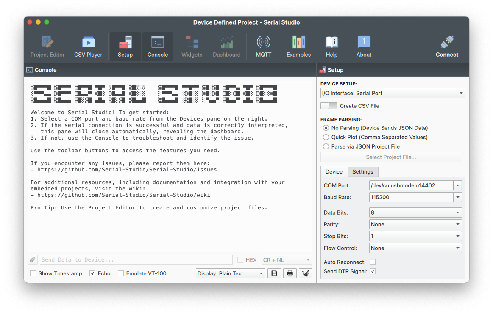

# Serial LTE Modem

## Overview

The Serial LTE Modem (SLM) application can be used to emulate a stand-alone LTE modem on the nRF9151 Connect Kit. The application accepts both the modem-specific AT commands and proprietary AT commands. The AT commands are documented in the following guides:

- Modem-specific AT commands - [nRF91x1 AT Commands Reference Guide]
- Proprietary AT commands - [SLM-specific AT commands]

## Requirements

Before you start, check that you have the required hardware and software:

- 1x [nRF9151 Connect Kit](https://makerdiary.com/products/nrf9151-connectkit)
- 1x nano-SIM card with LTE-M or NB-IoT support
- 1x U.FL cabled LTE-M/NB-IoT/NR+ Flexible Antenna (included in the box)
- 1x U.FL cabled GNSS Antenna (included in the box)
- 1x USB-C Cable
- [Serial Studio v3.0.6] or newer
- A computer running macOS, Ubuntu, or Windows 10 or newer

## Set up your board

1. Insert the nano-SIM card into the nano-SIM card slot.
2. Attach the U.FL cabled LTE-M/NB-IoT/NR+ Flexible Antenna.
3. Attach the U.FL cabled GNSS Antenna.
3. Connect the nRF9151 Connect Kit to the computer with a USB-C cable.


## Building the application

To build the application, follow the instructions in [Getting Started Guide] to set up your preferred building environment.

Use the following steps to build the [Serial LTE Modem] application on the command line.

1. Open a terminal window.

2. Go to `NCS-Project/nrf9151-connectkit` repository cloned in the [Getting Started Guide].

3. Build the application using the `west build` command, specifying the board (following the `-b` option) as `nrf9151_connectkit/nrf9151/ns`.

	``` bash
	west build -p always -b nrf9151_connectkit/nrf9151/ns applications/serial_lte_modem
	```

	The `-p` always option forces a pristine build, and is recommended for new users. Users may also use the `-p auto` option, which will use heuristics to determine if a pristine build is required, such as when building another application.

	!!! Note
		This application has Cortex-M Security Extensions (CMSE) enabled and separates the firmware between Non-Secure Processing Environment (NSPE) and Secure Processing Environment (SPE). Because of this, it automatically includes the [Trusted Firmware-M (TF-M)].

4. After building the application successfully, the firmware with the name `merged.hex` can be found in the `build` directory.

## Flashing the firmware

[Set up your board](#set-up-your-board) before flashing the firmware. You can flash the application using `west flash`:

``` bash
west flash
```

!!! Tip
	In case you wonder, the `west flash` will execute the following command:

	``` bash
	pyocd load --target nrf91 --frequency 4000000 build/merged.hex
	```

## Testing

After programming the application, test it by performing the following steps:

1. Start [Serial Studio][Serial Studio v3.0.6] application, and complete the following steps:

	1. Select __DEVICE SETUP__ -> __`Serial Port`__.
	2. Select __FRAME PARSING__ -> __`No Parsing`__.
	3. Select the correct serial port that your computer uses to communicate with the nRF9151 SiP from the __COM Port__ drop-down list.
	4. Select __Baud Rate__ -> __`115200`__, __Data Bits__ -> __`8`__, __Parity__ -> __`None`__, __Stop Bits__ -> __`1`__, __Flow Control__ -> __`None`__.
	5. Select __Send DTR Signal__.
	6. Click <kbd>:material-connection: Connect</kbd> .
	7. Select Line Ending -> __`CR+NL`__.

	


2. Press the __DFU/RST__ button to reset the nRF9151 SiP.

4. Observe that the board sends a `Ready\r\n` message on the console.

5. Send AT commands and observe the responses from the board. See [Testing scenarios] for typical test cases.


[nRF91x1 AT Commands Reference Guide]: https://docs.nordicsemi.com/bundle/ref_at_commands_nrf91x1/page/REF/at_commands/intro_nrf91x1.html
[SLM-specific AT commands]: https://docs.nordicsemi.com/bundle/ncs-latest/page/nrf/applications/serial_lte_modem/doc/AT_commands.html
[Serial Studio v3.0.6]: https://github.com/Serial-Studio/Serial-Studio/releases/tag/v3.0.6
[Getting Started Guide]: ../getting-started.md
[Serial LTE Modem]: https://github.com/makerdiary/nrf9151-connectkit/tree/main/applications/serial_lte_modem
[Trusted Firmware-M (TF-M)]: https://docs.nordicsemi.com/bundle/ncs-latest/page/nrf/security/tfm.html#ug-tfm
[Testing scenarios]: https://docs.nordicsemi.com/bundle/ncs-latest/page/nrf/applications/serial_lte_modem/doc/slm_testing.html
