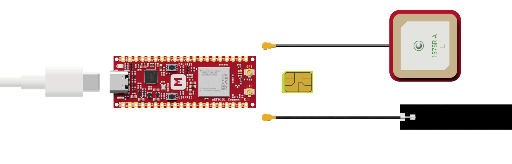

# GNSS

## Overview

The GNSS sample demonstrates how to use the [GNSS interface] to control the GNSS module.

The sample first initializes the GNSS module. Then it handles events from the interface, reads the associated data and outputs information to the console. Because NMEA data needs to be read as soon as an NMEA event is received, a Zephyr message queue is used for buffering the NMEA strings. The event handler function reads the received NMEA strings and puts those into the message queue. The consumer loop reads from the queue and outputs the strings to the console.

## Requirements

Before you start, check that you have the required hardware and software:

- 1x [nRF9151 Connect Kit](https://makerdiary.com/products/nrf9151-connectkit)
- 1x nano-SIM card with LTE-M or NB-IoT support
- 1x U.FL cabled LTE-M/NB-IoT/NR+ Flexible Antenna (included in the box)
- 1x U.FL cabled GNSS Antenna (included in the box)
- 1x USB-C Cable
- A computer running macOS, Ubuntu, or Windows 10 or newer

## Set up your board

1. Insert the nano-SIM card into the nano-SIM card slot.
2. Attach the U.FL cabled LTE-M/NB-IoT/NR+ Flexible Antenna.
3. Attach the U.FL cabled GNSS Antenna.
3. Connect the nRF9151 Connect Kit to the computer with a USB-C cable.



## Building the sample

To build the sample, follow the instructions in [Getting Started Guide] to set up your preferred building environment.

Use the following steps to build the [GNSS] sample on the command line.

1. Open a terminal window.

2. Go to `NCS-Project/nrf9151-connectkit` repository cloned in the [Getting Started Guide].

3. Build the sample using the `west build` command, specifying the board (following the `-b` option) as `nrf9151_connectkit/nrf9151/ns`.

	``` bash
	west build -p always -b nrf9151_connectkit/nrf9151/ns samples/gnss
	```

	The `-p` always option forces a pristine build, and is recommended for new users. Users may also use the `-p auto` option, which will use heuristics to determine if a pristine build is required, such as when building another sample.

	!!! Note
		This sample has Cortex-M Security Extensions (CMSE) enabled and separates the firmware between Non-Secure Processing Environment (NSPE) and Secure Processing Environment (SPE). Because of this, it automatically includes the [Trusted Firmware-M (TF-M)].

4. After building the sample successfully, the firmware with the name `merged.hex` can be found in the `build` directory.

## Flashing the firmware

[Set up your board](#set-up-your-board) before flashing the firmware. You can flash the sample using `west flash`:

``` bash
west flash
```

!!! Tip
	In case you wonder, the `west flash` will execute the following command:

	``` bash
	pyocd load --target nrf91 --frequency 4000000 build/merged.hex
	```

## Testing

After programming the sample, test it by performing the following steps:

1. Open up a serial terminal, specifying the correct serial port that your computer uses to communicate with the nRF9151 SiP:

	=== "Windows"

		1. Start [PuTTY].
		2. Configure the correct serial port and click __Open__:

			

	=== "macOS"

		Open up a terminal and run:

		``` bash
		screen <serial-port-name> 115200
		```

	=== "Ubuntu"

		Open up a terminal and run:

		``` bash
		screen <serial-port-name> 115200
		```

2. Press the __DFU/RST__ button to reset the nRF9151 SiP.

3. Observe that the following information is displayed in the terminal:

	``` { .txt .no-copy linenums="1" title="Terminal" }
	Tracking:  0 Using:  0 Unhealthy: 0
	-----------------------------------
	Seconds since last fix: 5
	Searching [/]

	NMEA strings:

	$GPGGA,000005.14,,,,,0,,99.99,,M,,M,,*66
	$GPGLL,,,,,000005.14,V,N*4A
	$GPGSA,A,1,,,,,,,,,,,,,99.99,99.99,99.99,1*2D
	$GPGSV,1,1,0,,,,,,,,,,,,,,,,,1*54
	$GPRMC,000005.14,V,,,,,,,060180,,,N,V*08
	```

4. Observe that the following information is displayed upon acquiring a fix:

	``` { .txt .no-copy linenums="1" title="Terminal" }
	Tracking: 12 Using: 10 Unhealthy: 0
	-----------------------------------
	Latitude:          22.693996
	Longitude:         113.941899
	Accuracy:          1.6 m
	Altitude:          104.9 m
	Altitude accuracy: 3.5 m
	Speed:             0.2 m/s
	Speed accuracy:    0.4 m/s
	V. speed:          0.2 m/s
	V. speed accuracy: 0.5 m/s
	Heading:           0.0 deg
	Heading accuracy:  180.0 deg
	Date:              2025-02-22
	Time (UTC):        07:27:23.089
	PDOP:              2.7
	HDOP:              1.1
	VDOP:              2.5
	TDOP:              1.9

	NMEA strings:

	$GPGGA,072723.09,2241.63975,N,11356.51394,E,1,10,1.08,104.91,M,,M,,*7C
	$GPGLL,2241.63975,N,11356.51394,E,072723.09,A,A*62
	$GPGSA,A,3,01,03,14,17,19,22,30,194,195,199,,,2.72,1.08,2.50,1*2C
	$GPGSV,5,1,18,1,38,035,36,2,36,238,,3,40,099,37,6,33,230,26,1*6E
	$GPGSV,5,2,18,7,39,211,,8,06,078,,9,-2,153,25,14,62,341,43,1*42
	$GPGSV,5,3,18,17,42,323,40,19,24,291,24,21,04,042,,22,41,330,38,1*60
	$GPGSV,5,4,18,30,42,225,39,31,45,231,,194,61,091,34,195,63,056,39,1*60
	$GPGSV,5,5,18,196,23,125,,199,59,149,33,1*65
	$GPRMC,072723.09,A,2241.63975,N,11356.51394,E,0.30,0.00,220225,,,A,V*29
	...
	```

!!! Tip "Optimize GNSS reception"

	* GNSS signals do not usually penetrate ceilings or other structures that well. For best GNSS performance, the antenna should be placed outside on a flat surface in an open space far from sources of interference and other structures that can block the satellite signals.
	* The GNSS patch antenna achieves the highest gain when placed horizontally on a surface (x-y) facing the z-axis since it can receive all propagated GNSS signals. A lower gain is experienced if the patch antenna is mounted at an angle.

[GNSS interface]: https://docs.nordicsemi.com/bundle/ncs-latest/page/nrfxlib/nrf_modem/doc/gnss_interface.html#gnss-interface
[Getting Started Guide]: ../getting-started.md
[GNSS]: https://github.com/makerdiary/nrf9151-connectkit/tree/main/samples/gnss
[Trusted Firmware-M (TF-M)]: https://docs.nordicsemi.com/bundle/ncs-latest/page/nrf/security/tfm.html#ug-tfm
[PuTTY]: https://apps.microsoft.com/store/detail/putty/XPFNZKSKLBP7RJ
