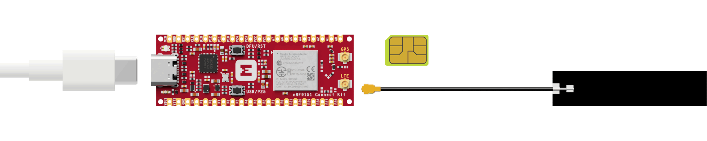
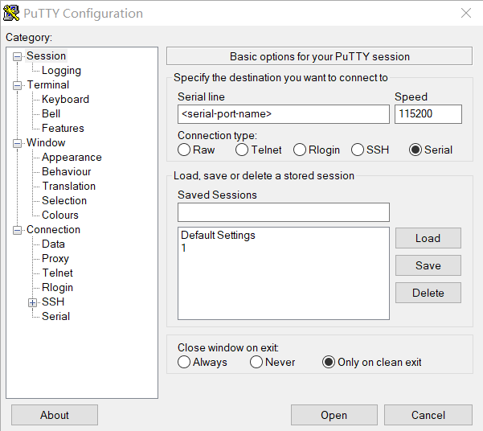

# Modem Trace Backend

## Overview

The Modem Trace Backend sample demonstrates how to add a user-defined modem trace backend to an application.

The sample implements and selects a custom trace backend to receive traces from the modem. For demonstration purposes, the custom trace backend counts the number of bytes received and calculates the data rate of modem traces received. The CPU utilization is also measured. The byte count, data rate, and CPU load are periodically printed to terminal using a delayable work item and the system workqueue.

The custom trace backend is implemented in `modem_trace_backend/src/trace_print_stats.c`. However, it is possible to add a custom modem trace backend as a library and use it in more than one application. See [Adding custom trace backends] for details.

## Requirements

Before you start, check that you have the required hardware and software:

- 1x [nRF9151 Connect Kit](https://makerdiary.com/products/nrf9151-connectkit)
- 1x nano-SIM card with LTE-M or NB-IoT support
- 1x U.FL cabled LTE-M/NB-IoT/NR+ Flexible Antenna (included in the box)
- 1x USB-C Cable
- A computer running macOS, Ubuntu, or Windows 10 or newer

## Set up your board

1. Insert the nano-SIM card into the nano-SIM card slot.
2. Attach the U.FL cabled LTE-M/NB-IoT/NR+ Flexible Antenna.
3. Connect the nRF9151 Connect Kit to the computer with a USB-C cable.



## Building the sample

To build the sample, follow the instructions in [Getting Started Guide] to set up your preferred building environment.

Use the following steps to build the [Modem Trace Backend] sample on the command line.

1. Open a terminal window.

2. Go to `NCS-Project/nrf9151-connectkit` repository cloned in the [Getting Started Guide].

3. Build the sample using the `west build` command, specifying the board (following the `-b` option) as `nrf9151_connectkit/nrf9151/ns`.

	``` bash
	west build -p always -b nrf9151_connectkit/nrf9151/ns samples/modem_trace_backend
	```

	The `-p` always option forces a pristine build, and is recommended for new users. Users may also use the `-p auto` option, which will use heuristics to determine if a pristine build is required, such as when building another sample.

	!!! Note
		This sample has Cortex-M Security Extensions (CMSE) enabled and separates the firmware between Non-Secure Processing Environment (NSPE) and Secure Processing Environment (SPE). Because of this, it automatically includes the [Trusted Firmware-M (TF-M)].

4. After building the sample successfully, the firmware with the name `tfm_merged.hex` can be found in the `build/modem_trace_backend/zephyr` directory.

## Flashing the firmware

[Set up your board](#set-up-your-board) before flashing the firmware. You can flash the sample using `west flash`:

``` bash
west flash
```

!!! Tip
	In case you wonder, the `west flash` will execute the following command:

	``` bash
	pyocd load --target nrf91 --frequency 4000000 build/modem_trace_backend/zephyr/tfm_merged.hex
	```

## Testing

After programming the sample, test it by performing the following steps:

1. Open up a serial terminal, specifying the correct serial port that your computer uses to communicate with the nRF9151 SiP:

	=== "Windows"

		1. Start [PuTTY].
		2. Configure the correct serial port and click __Open__:

			

	=== "macOS"

		Open up a terminal and run:

		``` bash
		screen <serial-port-name> 115200
		```

	=== "Ubuntu"

		Open up a terminal and run:

		``` bash
		screen <serial-port-name> 115200
		```

2. Press the __DFU/RST__ button to reset the nRF9151 SiP.

3. Observe the output of the terminal. You should see the output, similar to what is shown in the following:

	``` { .txt .no-copy linenums="1" title="Terminal" }
	[INF] All pins have been configured as non-secure
	[NOT] Booting TF-M v2.3.0**
	[NOT] Built Thu 18 Jun 2026 06:31:57 UTC
	[INF] Float ABI: Hard, Lazy stacking enabled
	*** Booting nRF Connect SDK v3.3.99-95ed8f7e7406 ***
	*** Using Zephyr OS v4.4.0-14033cef1f73 ***
	Modem trace backend sample started
	Initializing modem library
	Custom trace backend initialized
	Connecting to network
	LTE mode changed to 1
	Traces received:  11.9kB, 23.7kB/s, CPU-load:  2.72%
	Traces received:  15.1kB,  6.4kB/s, CPU-load:  0.96%
	Traces received:  18.2kB,  6.1kB/s, CPU-load:  0.93%
	Traces received:  29.5kB, 22.5kB/s, CPU-load:  1.16%
	Traces received:  54.0kB, 48.4kB/s, CPU-load:  2.47%
	Traces received:  78.4kB, 48.5kB/s, CPU-load:  2.44%
	Traces received: 112.9kB, 68.2kB/s, CPU-load:  3.93%
	Traces received: 148.3kB, 70.3kB/s, CPU-load:  3.85%
	Traces received: 185.2kB, 72.9kB/s, CPU-load:  4.08%
	Traces received: 219.9kB, 68.8kB/s, CPU-load:  3.86%
	LTE mode changed to 0
	Custom trace backend deinitialized
	Bye
	```

[Adding custom trace backends]: https://docs.nordicsemi.com/bundle/ncs-latest/page/nrf/libraries/modem/nrf_modem_lib/nrf_modem_lib_trace.html#adding-custom-modem-trace-backends
[Getting Started Guide]: ../getting-started.md
[Modem Trace Backend]: https://github.com/makerdiary/nrf9151-connectkit/tree/main/samples/modem_trace_backend
[Trusted Firmware-M (TF-M)]: https://docs.nordicsemi.com/bundle/ncs-latest/page/nrf/security/tfm.html#ug-tfm
[PuTTY]: https://apps.microsoft.com/store/detail/putty/XPFNZKSKLBP7RJ
