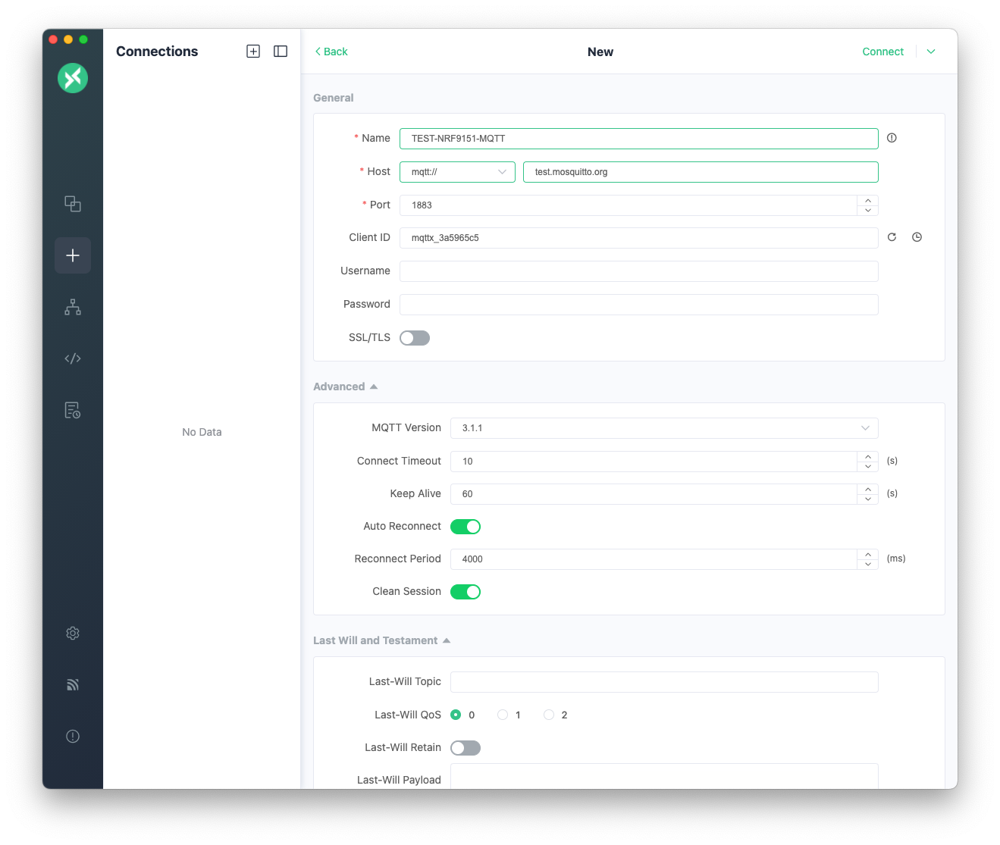
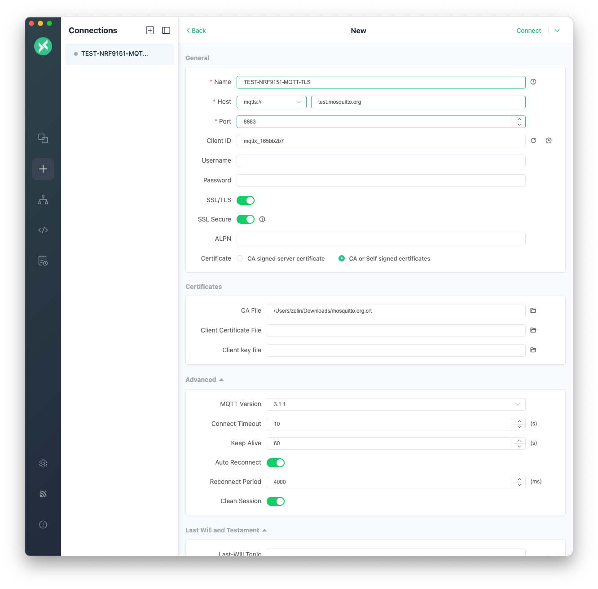
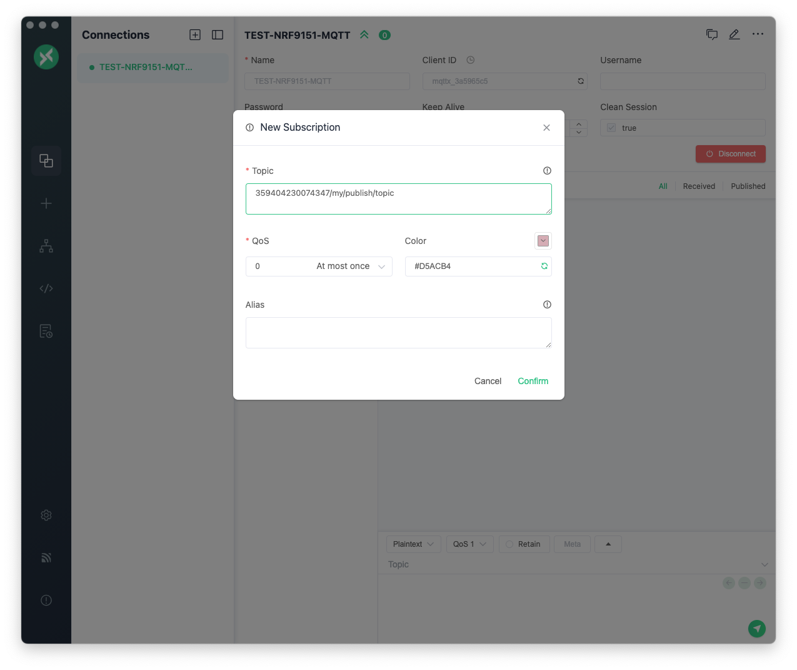
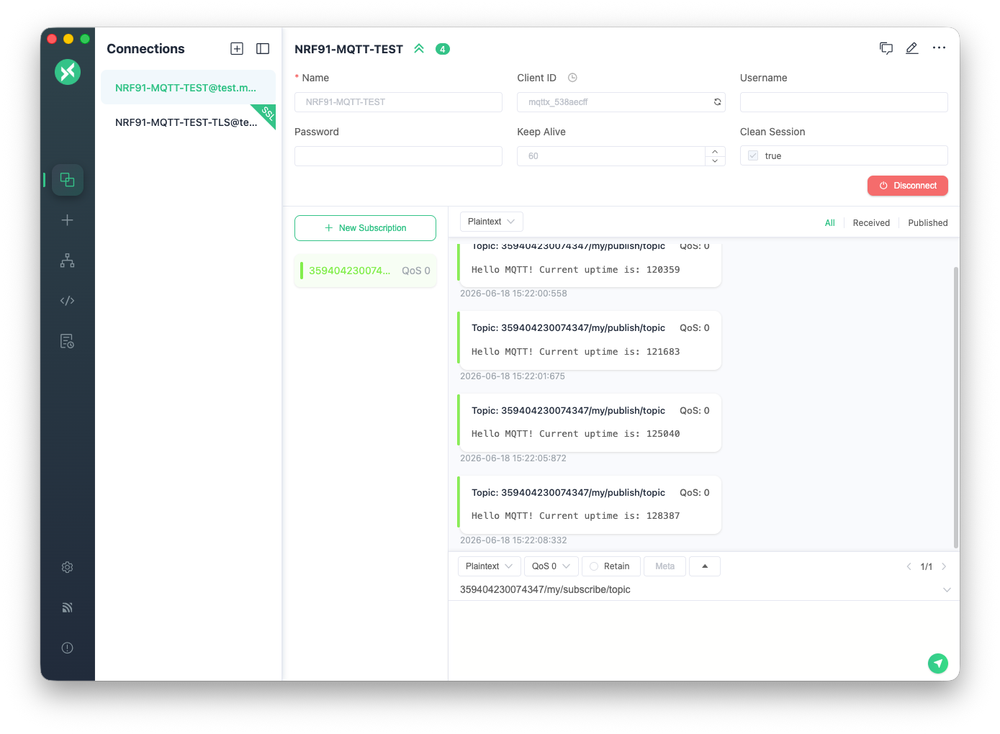
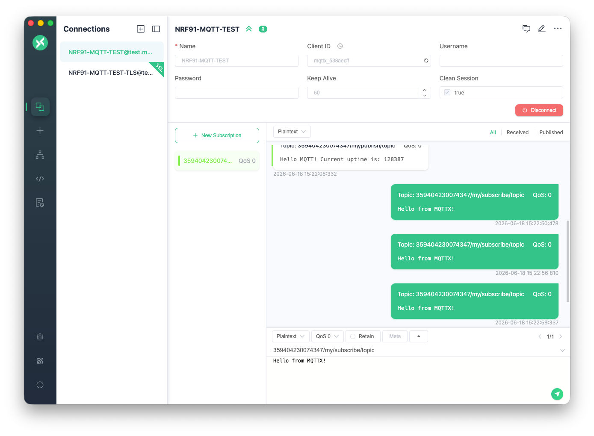

# MQTT

## Overview

The MQTT sample demonstrates how to communicate with an MQTT broker.

The sample connects to an LTE network using the [Connection Manager]. Then it connects to a configured MQTT server (default is [test.mosquitto.org](https://test.mosquitto.org/)), where it publishes messages to the topic `<clientID>/my/publish/topic`. You can also trigger message publication by pressing the __USR/P25__ button on the board.

The sample also subscribes to the topic `<clientID>/my/subscribe/topic`, and receives any message published to that topic.

The sample supports Transport Layer Security (TLS) and it can be enabled through overlay configuration files included in the sample.

## Requirements

Before you start, check that you have the required hardware and software:

- 1x [nRF9151 Connect Kit](https://makerdiary.com/products/nrf9151-connectkit)
- 1x nano-SIM card with LTE-M or NB-IoT support
- 1x U.FL cabled LTE-M/NB-IoT/NR+ Flexible Antenna (included in the box)
- 1x USB-C Cable
- An MQTT Client such as [MQTTX] for testing
- A computer running macOS, Ubuntu, or Windows 10 or newer

## Set up your board

1. Insert the nano-SIM card into the nano-SIM card slot.
2. Attach the U.FL cabled LTE-M/NB-IoT/NR+ Flexible Antenna.
3. Connect the nRF9151 Connect Kit to the computer with a USB-C cable.


## Building the sample

To build the sample, follow the instructions in [Getting Started Guide] to set up your preferred building environment.

Use the following steps to build the [MQTT] sample on the command line.

1. Open a terminal window.

2. Go to `NCS-Project/nrf9151-connectkit` repository cloned in the [Getting Started Guide].

3. Build the sample using the `west build` command, specifying the board (following the `-b` option) as `nrf9151_connectkit/nrf9151/ns`.

	=== "Unencrypted (default)"

		``` bash
		west build -p always -b nrf9151_connectkit/nrf9151/ns samples/mqtt
		```

	=== "Encrypted"

		``` bash
		west build -p always -b nrf9151_connectkit/nrf9151/ns samples/mqtt -- -DEXTRA_CONF_FILE=overlay-tls-nrf91.conf
		```

	The `-p` always option forces a pristine build, and is recommended for new users. Users may also use the `-p auto` option, which will use heuristics to determine if a pristine build is required, such as when building another sample.

	!!! Note
		This sample has Cortex-M Security Extensions (CMSE) enabled and separates the firmware between Non-Secure Processing Environment (NSPE) and Secure Processing Environment (SPE). Because of this, it automatically includes the [Trusted Firmware-M (TF-M)].

4. After building the sample successfully, the firmware with the name `tfm_merged.hex` can be found in the `build/mqtt/zephyr` directory.

## Flashing the firmware

[Set up your board](#set-up-your-board) before flashing the firmware. You can flash the sample using `west flash`:

``` bash
west flash
```

!!! Tip
	In case you wonder, the `west flash` will execute the following command:

	``` bash
	pyocd load --target nrf91 --frequency 4000000 build/mqtt/zephyr/tfm_merged.hex
	```

## Testing

After programming the sample, test it by performing the following steps:

1. Open up a serial terminal, specifying the correct serial port that your computer uses to communicate with the nRF9151 SiP:

	=== "Windows"

		1. Start [PuTTY].
		2. Configure the correct serial port and click __Open__:

			

	=== "macOS"

		Open up a terminal and run:

		``` bash
		screen <serial-port-name> 115200
		```

	=== "Ubuntu"

		Open up a terminal and run:

		``` bash
		screen <serial-port-name> 115200
		```

2. Press the __DFU/RST__ button to reset the nRF9151 SiP.

3. Start [MQTTX], set up a __New Connection__ and then __Connect__:

	=== "Unencrypted (default)"

		*  __Host__: `test.mosquitto.org`
		* __Port__: `1883`
		* __MQTT Version__: `3.1.1`

		[](../../../assets/images/mqttx_new_connections.png)

	=== "Encrypted"

		*  __Host__: `test.mosquitto.org`
		* __Port__: `8883`
		* __SSL/TLS__: Yes
		* __CA File__: [mosquitto.org.crt (PEM format)](https://test.mosquitto.org/ssl/mosquitto.org.crt)
		* __MQTT Version__: `3.1.1`

		[](../../../assets/images/mqttx_new_connections_tls.png)

4. Click __New Subscription__, subscribe the topic `<clientID>/my/publish/topic`, and __Confirm__:

	[](../../../assets/images/mqttx_new_subscription.png)

5. Wait for the nRF9151 Connect Kit connecting to the newtwork. MQTTX will display the messages that the board published to `<clientID>/my/publish/topic`. You can also trigger message publication by pressing the __USR/P25__ button on the board.

	[](../../../assets/images/mqttx_message_received.png)

6. In the MQTTX client, you can pushlish messages to the topic `<clientID>/my/subscribe/topic`. The nRF9151 Connect Kit will display the messages published to that topic.

	[](../../../assets/images/mqttx_message_publish.png)

7. Observe the output of the terminal. You should see the output, similar to what is shown in the following:

	=== "Unencrypted (default)"

		``` { .txt .no-copy linenums="1" title="Terminal" }
		[INF] All pins have been configured as non-secure
		[NOT] Booting TF-M v2.3.0**
		[NOT] Built Thu 18 Jun 2026 07:15:56 UTC
		*** Booting nRF Connect SDK v3.3.99-95ed8f7e7406 ***
		*** Using Zephyr OS v4.4.0-14033cef1f73 ***
		[00:00:00.357,727] <inf> network: Bringing network interface up and connecting to the network
		+CGEV: EXCE STATUS 0
		%MDMEV: SEARCH STATUS 1
		+CEREG: 2,"1D23","0D70394B",9
		%MDMEV: PRACH CE-LEVEL 0
		+CSCON: 1
		+CGEV: ME PDN ACT 0,0
		+CNEC_ESM: 50,0
		%MDMEV: SEARCH STATUS 2
		+CEREG: 1,"1D23","0D70394B",9,,,"00100001","00000110"
		[00:01:20.458,129] <inf> network: Network connectivity established
		[00:01:26.784,210] <inf> transport: Connected to MQTT broker
		[00:01:26.784,240] <inf> transport: Hostname: test.mosquitto.org
		[00:01:26.784,301] <inf> transport: Client ID: 359404230074347
		[00:01:26.784,301] <inf> transport: Port: 1883
		[00:01:26.784,332] <inf> transport: TLS: No
		[00:01:26.784,393] <inf> transport: Subscribing to: 359404230074347/my/subscribe/topic
		[00:01:27.118,774] <inf> transport: Subscribed to topic 359404230074347/my/subscribe/topic
		+CSCON: 0
		[00:02:00.366,760] <inf> transport: Published message: "Hello MQTT! Current uptime is: 120359" on topic: "359404230074347/my/publish/topic"
		%MDMEV: PRACH CE-LEVEL 0
		+CSCON: 1
		[00:02:01.684,906] <inf> transport: Published message: "Hello MQTT! Current uptime is: 121683" on topic: "359404230074347/my/publish/topic"
		[00:02:05.042,236] <inf> transport: Published message: "Hello MQTT! Current uptime is: 125040" on topic: "359404230074347/my/publish/topic"
		[00:02:08.388,519] <inf> transport: Published message: "Hello MQTT! Current uptime is: 128387" on topic: "359404230074347/my/publish/topic"
		+CSCON: 0
		%MDMEV: PRACH CE-LEVEL 0
		+CSCON: 1
		[00:02:53.942,626] <inf> transport: Received payload: Hello from MQTTX! on topic: 359404230074347/my/subscribe/topic
		[00:02:57.680,603] <inf> transport: Received payload: Hello from MQTTX! on topic: 359404230074347/my/subscribe/topic
		[00:03:00.234,710] <inf> transport: Received payload: Hello from MQTTX! on topic: 359404230074347/my/subscribe/topic
		...
		```

	=== "Encrypted"

		``` { .txt .no-copy linenums="1" title="Terminal" }
		[INF] All pins have been configured as non-secure
		[NOT] Booting TF-M v2.3.0**
		[NOT] Built Thu 18 Jun 2026 07:29:18 UTC
		*** Booting nRF Connect SDK v3.3.99-95ed8f7e7406 ***
		*** Using Zephyr OS v4.4.0-14033cef1f73 ***
		[00:00:00.360,321] <inf> network: Bringing network interface up and connecting to the network
		+CGEV: EXCE STATUS 0
		%MDMEV: SEARCH STATUS 1
		+CEREG: 2,"1D23","0D70394B",9
		%MDMEV: PRACH CE-LEVEL 0
		+CSCON: 1
		+CGEV: ME PDN ACT 0,0
		+CNEC_ESM: 50,0
		%MDMEV: SEARCH STATUS 2
		+CEREG: 1,"1D23","0D70394B",9,,,"00100001","00000110"
		[00:01:18.839,080] <inf> network: Network connectivity established
		[00:01:27.249,084] <inf> transport: Connected to MQTT broker
		[00:01:27.249,145] <inf> transport: Hostname: test.mosquitto.org
		[00:01:27.249,176] <inf> transport: Client ID: 359404230074347
		[00:01:27.249,176] <inf> transport: Port: 8883
		[00:01:27.249,206] <inf> transport: TLS: Yes
		[00:01:27.249,267] <inf> transport: Subscribing to: 359404230074347/my/subscribe/topic
		[00:01:27.568,969] <inf> transport: Subscribed to topic 359404230074347/my/subscribe/topic
		+CSCON: 0
		%MDMEV: PRACH CE-LEVEL 0
		+CSCON: 1
		[00:02:00.364,105] <inf> transport: Published message: "Hello MQTT! Current uptime is: 120361" on topic: "359404230074347/my/publish/topic"
		+CSCON: 0
		%MDMEV: PRACH CE-LEVEL 0
		+CSCON: 1
		+CSCON: 0
		[00:03:00.370,208] <inf> transport: Published message: "Hello MQTT! Current uptime is: 180362" on topic: "359404230074347/my/publish/topic"
		%MDMEV: PRACH CE-LEVEL 0
		+CSCON: 1
		+CSCON: 0
		%MDMEV: PRACH CE-LEVEL 0
		+CSCON: 1
		[00:03:49.814,117] <inf> transport: Published message: "Hello MQTT! Current uptime is: 229812" on topic: "359404230074347/my/publish/topic"
		[00:03:51.194,488] <inf> transport: Published message: "Hello MQTT! Current uptime is: 231192" on topic: "359404230074347/my/publish/topic"
		[00:03:52.093,536] <inf> transport: Published message: "Hello MQTT! Current uptime is: 232091" on topic: "359404230074347/my/publish/topic"
		[00:03:53.693,298] <inf> transport: Published message: "Hello MQTT! Current uptime is: 233691" on topic: "359404230074347/my/publish/topic"
		[00:04:00.364,654] <inf> transport: Published message: "Hello MQTT! Current uptime is: 240362" on topic: "359404230074347/my/publish/topic"
		[00:04:18.631,286] <inf> transport: Received payload: Hello from MQTTX! on topic: 359404230074347/my/subscribe/topic
		[00:04:22.194,335] <inf> transport: Received payload: Hello from MQTTX! on topic: 359404230074347/my/subscribe/topic
		[00:04:23.304,351] <inf> transport: Received payload: Hello from MQTTX! on topic: 359404230074347/my/subscribe/topic
		[00:04:23.615,905] <inf> transport: Received payload: Hello from MQTTX! on topic: 359404230074347/my/subscribe/topic
		...
		```

[Connection Manager]: https://docs.nordicsemi.com/bundle/ncs-latest/page/zephyr/connectivity/networking/conn_mgr/main.html#conn-mgr-overview
[Getting Started Guide]: ../getting-started.md
[MQTT]: https://github.com/makerdiary/nrf9151-connectkit/tree/main/samples/mqtt
[MQTTX]: https://mqttx.app/
[Trusted Firmware-M (TF-M)]: https://docs.nordicsemi.com/bundle/ncs-latest/page/nrf/security/tfm.html#ug-tfm
[PuTTY]: https://apps.microsoft.com/store/detail/putty/XPFNZKSKLBP7RJ
