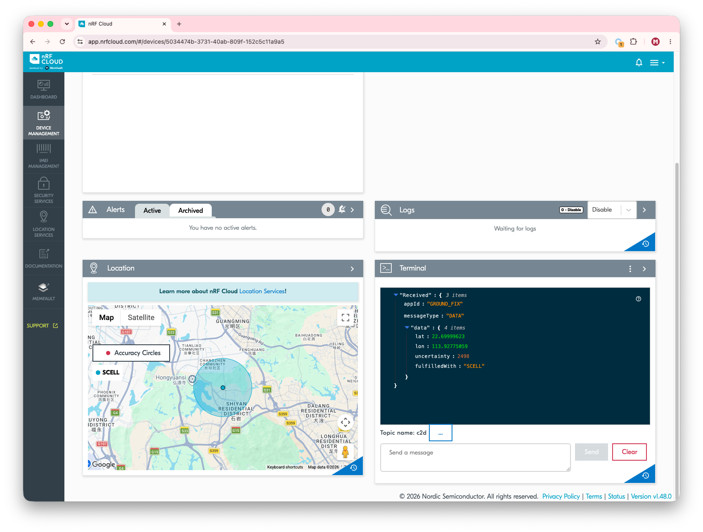

# nRF Cloud CoAP Cellular Location

## Overview

The nRF Cloud CoAP Cellular Location sample demonstrates how to use the [nRF Cloud CoAP API] for nRF Cloud’s cellular location service on your device.

After the sample initializes and connects to the network, it sends a cell location request to nRF Cloud. For this purpose, the sample uses network data obtained from the [Location] library.

See the [nRF Cloud Location Services documentation] page for additional information.


## Requirements

Before you start, check that you have the required hardware and software:

- 1x [nRF9151 Connect Kit](https://makerdiary.com/products/nrf9151-connectkit)
- 1x nano-SIM card with LTE-M or NB-IoT support
- 1x U.FL cabled LTE-M/NB-IoT/NR+ Flexible Antenna (included in the box)
- 1x USB-C Cable
- A computer running macOS, Ubuntu, or Windows 10 or newer

## Don't have an nRF Cloud account?

To connect your device and use nRF Cloud services, you must create an nRF Cloud account:

1. Go to the [nRF Cloud] portal and click __Register__.
2. Enter your email address and choose a password.
3. Click __Create Account__.
4. Check for a verification email from nRF Cloud.

    !!! Tip
        If you do not see the verification email, check your junk mail folder for an email from `no-reply@verificationemail.com`.

5. Copy the six-digit verification code and paste it into the registration dialog box.

    !!! Tip
        If you accidentally closed the registration dialog box, repeat Step 1 and click __Already have a code?__. Enter your email address and verification code.

You can now log in to the nRF Cloud portal with your email and password. After logging in, you can see the __Dashboard__ view that displays your device count and service usage.

!!! Warning "Device on-boarding with nRF Cloud"

    Your device must be onboarded with nRF Cloud. If it is not, follow the [nRF Cloud Device Provisioning] to provision your device.

## Set up your board

1. Insert the nano-SIM card into the nano-SIM card slot.
2. Attach the U.FL cabled LTE-M/NB-IoT/NR+ Flexible Antenna.
3. Connect the nRF9151 Connect Kit to the computer with a USB-C cable.


## Building the sample

To build the sample, follow the instructions in [Getting Started Guide] to set up your preferred building environment.

Use the following steps to build the [nRF Cloud CoAP Cellular Location] sample on the command line.

1. Open a terminal window.

2. Go to `NCS-Project/nrf9151-connectkit` repository cloned in the [Getting Started Guide].

3. Build the sample using the `west build` command, specifying the board (following the `-b` option) as `nrf9151_connectkit/nrf9151/ns`.

    ``` bash
    west build -p always -b nrf9151_connectkit/nrf9151/ns samples/nrf_cloud_coap_cell_location
    ```

    The `-p` always option forces a pristine build, and is recommended for new users. Users may also use the `-p auto` option, which will use heuristics to determine if a pristine build is required, such as when building another sample.

    !!! Note
        This sample has Cortex-M Security Extensions (CMSE) enabled and separates the firmware between Non-Secure Processing Environment (NSPE) and Secure Processing Environment (SPE). Because of this, it automatically includes the [Trusted Firmware-M (TF-M)].

4. After building the sample successfully, the firmware with the name `tfm_merged.hex` can be found in the `build/nrf_cloud_coap_cell_location/zephyr` directory.

## Flashing the firmware

[Set up your board](#set-up-your-board) before flashing the firmware. You can flash the sample using `west flash`:

``` bash
west flash
```

!!! Tip
    In case you wonder, the `west flash` will execute the following command:

    ``` bash
    pyocd load --target nrf91 --frequency 4000000 build/nrf_cloud_coap_cell_location/zephyr/tfm_merged.hex
    ```

## Testing

After programming the sample, test it by performing the following steps:

1. Open up a serial terminal, specifying the correct serial port that your computer uses to communicate with the nRF9151 SiP:

    === "Windows"

        1. Start [PuTTY].
        2. Configure the correct serial port and click __Open__:

            

    === "macOS"

        Open up a terminal and run:

        ``` bash
        screen <serial-port-name> 115200
        ```

    === "Ubuntu"

        Open up a terminal and run:

        ``` bash
        screen <serial-port-name> 115200
        ```

2. Press the __DFU/RST__ button to reset the nRF9151 SiP.
3. Once the device is provisioned and connected, you should see the output, similar to what is shown in the following:

	``` { .txt .no-copy linenums="1" title="Terminal" }
    [INF] All pins have been configured as non-secure
    [NOT] Booting TF-M v2.3.0**
    [NOT] Built Thu 18 Jun 2026 08:18:54 UTC
    [INF] Float ABI: Hard, Lazy stacking enabled
    *** Booting My Application v1.0.0-e67dc29a98a4 ***
    *** Using nRF Connect SDK v3.3.99-95ed8f7e7406 ***
    *** Using Zephyr OS v4.4.0-14033cef1f73 ***
    [00:00:00.259,582] <inf> nrf_cloud_coap_cell_location_sample: nRF Cloud CoAP Cellular Location Sample, version: 1.0.0
    [00:00:00.536,926] <inf> nrf_cloud_coap_cell_location_sample: Connecting to LTE...
    +CGEV: EXCE STATUS 0
    %MDMEV: SEARCH STATUS 1
    +CEREG: 2,"1D23","0D70394B",9
    %MDMEV: PRACH CE-LEVEL 0
    +CSCON: 1
    +CGEV: ME PDN ACT 0,0
    +CNEC_ESM: 50,0
    %MDMEV: SEARCH STATUS 2
    +CEREG: 1,"1D23","0D70394B",9,,,"11100000","11100000"
    [00:01:19.052,642] <inf> nrf_cloud_coap_cell_location_sample: Connected to network
    [00:01:19.086,029] <inf> nrf_cloud_info: Device ID: 5034474b-3731-40ab-809f-152c5c11a9a5
    [00:01:19.087,524] <inf> nrf_cloud_info: IMEI:      359404230074347
    [00:01:19.193,695] <inf> nrf_cloud_info: UUID:      5034474b-3731-40ab-809f-152c5c11a9a5
    [00:01:19.194,152] <inf> nrf_cloud_info: Modem FW:  mfw_nrf91x1_2.0.4
    [00:01:19.194,183] <inf> nrf_cloud_info: Protocol:          CoAP
    [00:01:19.194,244] <inf> nrf_cloud_info: Download protocol: HTTPS
    [00:01:19.194,274] <inf> nrf_cloud_info: Sec tag:           16842753
    [00:01:19.194,274] <inf> nrf_cloud_info: CoAP JWT Sec tag:  16842753
    [00:01:19.194,305] <inf> nrf_cloud_info: Host name:         coap.nrfcloud.com
    [00:01:23.795,013] <inf> nrf_cloud_coap_transport: Request authorization with JWT
    [00:01:24.426,605] <inf> nrf_cloud_coap_transport: Authorization result_code: 2.01
    [00:01:24.426,849] <inf> nrf_cloud_coap_transport: Authorized
    [00:01:24.427,215] <inf> nrf_cloud_coap_transport: DTLS CID is active
    [00:01:25.243,865] <inf> nrf_cloud_coap_cell_location_sample: Requesting location with the default configuration...
    %NCELLMEAS: 0,"0D70394B","46000","1D23",32,3682,174,49,25,76120,84428
    %NCELLMEAS: 0,"0D70394B","46000","1D23",32,84428,3682,174,47,29,84553,1,0
    %NCELLMEAS: 0,"0D70394B","46000","1D23",32,84428,3682,174,47,29,84553,1,0
    [00:01:25.696,105] <inf> nrf_cloud_coap_cell_location_sample: Cellular location request fulfilled with single-cell
    [00:01:25.696,136] <inf> nrf_cloud_coap_cell_location_sample: Lat: 22.699996, Lon: 113.927751, Uncertainty: 2498 m
    [00:01:25.696,166] <inf> nrf_cloud_coap_cell_location_sample: Google maps URL: https://maps.google.com/?q=22.699996,113.927751
	```

4. After the cell location request sent to nRF Cloud, verify that on the nRF Cloud:

    1. Select __Device Management__ -> __Devices__.
    2. Click the ID of the device you added.
    3. On the device’s page, you should see the cell location displayed on the Location tab.

    

[nRF Cloud]: https://nrfcloud.com/
[nRF Cloud CoAP API]: https://docs.nrfcloud.com/docs/nrfcloud/coap-overview
[Location]: https://nrfconnectdocs.nordicsemi.com/ncs/latest/nrf/libraries/modem/location.html#lib-location
[nRF Cloud Location Services documentation]: https://docs.nrfcloud.com/docs/platform/location-services
[nRF Cloud Device Provisioning]: ./nrf_provisioning.md
[Getting Started Guide]: ../getting-started.md
[nRF Cloud CoAP Cellular Location]: https://github.com/makerdiary/nrf9151-connectkit/tree/main/samples/nrf_cloud_coap_cell_location
[Trusted Firmware-M (TF-M)]: https://docs.nordicsemi.com/bundle/ncs-latest/page/nrf/security/tfm.html#ug-tfm
[PuTTY]: https://apps.microsoft.com/store/detail/putty/XPFNZKSKLBP7RJ
