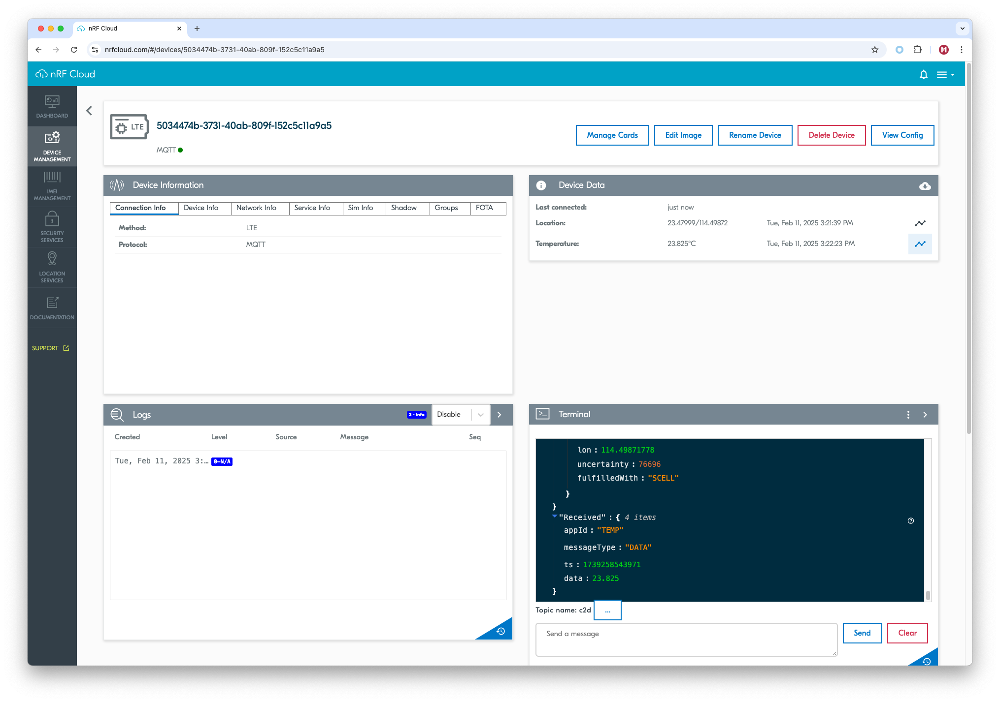

# nRF Cloud Multi-service

The nRF Cloud Multi-service sample is a minimal, error tolerant, integrated demonstration of the [nRF Cloud], [Location], and [AT Host] libraries.

It demonstrates how you can integrate Firmware-Over-The-Air (FOTA), Location Services, Alert and Log Services, periodic sensor sampling, and more in your nRF Cloud-enabled application.

It also demonstrates how to build connected, error-tolerant applications without worrying about physical-level specifics using Zephyr’s __`conn_mgr`__.

Refer to the nRF Connect SDK's [nRF Cloud multi-service Documentation] for more details.

## Requirements

Before you start, check that you have the required hardware and software:

- 1x [nRF9151 Connect Kit](https://makerdiary.com/products/nrf9151-connectkit)
- 1x nano-SIM card with LTE-M or NB-IoT support
- 1x U.FL cabled LTE-M/NB-IoT/NR+ Flexible Antenna (included in the box)
- 1x USB-C Cable
- A computer running macOS, Ubuntu, or Windows 10 or newer

## Don't have an nRF Cloud account?

To connect your device and use nRF Cloud services, you must create an nRF Cloud account:

1. Go to the [nRF Cloud] portal and click __Register__.
2. Enter your email address and choose a password.
3. Click __Create Account__.
4. Check for a verification email from nRF Cloud.

	!!! Tip
		If you do not see the verification email, check your junk mail folder for an email from `no-reply@verificationemail.com`.

5. Copy the six-digit verification code and paste it into the registration dialog box.

	!!! Tip
		If you accidentally closed the registration dialog box, repeat Step 1 and click __Already have a code?__. Enter your email address and verification code.

You can now log in to the nRF Cloud portal with your email and password. After logging in, you can see the __Dashboard__ view that displays your device count and service usage.

## Set up your board

1. Insert the nano-SIM card into the nano-SIM card slot.
2. Attach the U.FL cabled LTE-M/NB-IoT/NR+ Flexible Antenna.
3. Connect the nRF9151 Connect Kit to the computer with a USB-C cable.


## Building the sample

To build the sample, follow the instructions in [Getting Started Guide] to set up your preferred building environment.

Use the following steps to build the [nRF Cloud Multi-service] sample on the command line.

1. Open a terminal window.

2. Go to `NCS-Project/nrf9151-connectkit` repository cloned in the [Getting Started Guide].

3. Build the sample using the `west build` command, specifying the board (following the `-b` option) as `nrf9151_connectkit/nrf9151/ns`.

	``` bash
	west build -p always -b nrf9151_connectkit/nrf9151/ns samples/nrf_cloud_multi_service -- -DEXTRA_CONF_FILE="overlay-http_nrf_provisioning.conf"
	```

	The `-p` always option forces a pristine build, and is recommended for new users. Users may also use the `-p auto` option, which will use heuristics to determine if a pristine build is required, such as when building another sample.

	!!! Note
		This sample has Cortex-M Security Extensions (CMSE) enabled and separates the firmware between Non-Secure Processing Environment (NSPE) and Secure Processing Environment (SPE). Because of this, it automatically includes the [Trusted Firmware-M (TF-M)].

4. After building the sample successfully, the firmware with the name `merged.hex` can be found in the `build` directory.

## Flashing the firmware

[Set up your board](#set-up-your-board) before flashing the firmware. You can flash the sample using `west flash`:

``` bash
west flash
```

!!! Tip
	In case you wonder, the `west flash` will execute the following command:

	``` bash
	pyocd load --target nrf91 --frequency 4000000 build/merged.hex
	```

## Testing

After programming the sample, test it by performing the following steps:

1. Open up a serial terminal, specifying the correct serial port that your computer uses to communicate with the nRF9151 SiP:

	=== "Windows"

		1. Start [PuTTY].
		2. Configure the correct serial port and click __Open__:

			

	=== "macOS"

		Open up a terminal and run:

		``` bash
		screen <serial-port-name> 115200
		```

	=== "Ubuntu"

		Open up a terminal and run:

		``` bash
		screen <serial-port-name> 115200
		```

2. Press the __DFU/RST__ button to reset the nRF9151 SiP.

3. Once the device is provisioned and connected, you should see the output, similar to what is shown in the following:

	``` { .txt .no-copy linenums="1" title="Terminal" }
	*** Booting My Application v2.1.0-dev-3a25855215a2 ***
	*** Using nRF Connect SDK v2.9.99-98a5e50b9ac1 ***
	*** Using Zephyr OS v3.7.99-693769a5c735 ***
	I: Starting bootloader
	I: Primary image: magic=bad, swap_type=0x1, copy_done=0x2, image_ok=0x2
	I: Secondary image: magic=unset, swap_type=0x1, copy_done=0x3, image_ok=0x3
	I: Boot source: none
	I: Image index: 0, Swap type: none
	I: Bootloader chainload address offset: 0x10000
	All pins have been configured as non-secure
	Booting TF-M v2.1.0
	[Sec Thread] Secure image initializing!
	TF-M Float ABI: Hard
	Lazy stacking enabled

	*** Booting nRF Connect SDK v2.9.99-98a5e50b9ac1 ***
	*** Using Zephyr OS v3.7.99-693769a5c735 ***
	[00:00:00.256,439] <inf> main: nRF Cloud multi-service sample has started, version: 1.0.0, protocol: MQTT
	[00:00:00.256,469] <inf> application: Reset reason: 0x10001
	[00:00:00.256,591] <inf> cloud_connection: Enabling connectivity...
	[00:00:00.585,540] <inf> cloud_connection: Setting up nRF Cloud library...
	[00:00:00.678,619] <inf> nrf_cloud_info: Device ID: 5034474b-3731-40ab-809f-152c5c11a9a5
	[00:00:00.679,107] <inf> nrf_cloud_info: IMEI:      359404230074347
	[00:00:00.764,770] <inf> nrf_cloud_info: UUID:      5034474b-3731-40ab-809f-152c5c11a9a5
	[00:00:00.765,167] <inf> nrf_cloud_info: Modem FW:  mfw_nrf91x1_2.0.2
	[00:00:00.765,197] <inf> nrf_cloud_info: Protocol:          MQTT
	[00:00:00.765,228] <inf> nrf_cloud_info: Download protocol: HTTPS
	[00:00:00.765,258] <inf> nrf_cloud_info: Sec tag:           16842753
	[00:00:00.765,289] <inf> nrf_cloud_info: Host name:         mqtt.nrfcloud.com
	[00:00:01.164,154] <inf> nrf_cloud_credentials: Sec Tag: 16842753; CA: Yes, Client Cert: Yes, Private Key: Yes
	[00:00:01.164,245] <inf> nrf_cloud_credentials: CA Size: 1792, AWS: Likely, CoAP: Likely
	[00:00:01.164,245] <inf> cloud_connection: Waiting for network ready...
	[00:01:24.932,098] <inf> cloud_connection: Network connectivity gained!
	[00:01:25.932,312] <inf> cloud_provisioning: Initializing the nRF Provisioning library...
	[00:01:25.932,861] <inf> cloud_connection: Network is ready
	[00:01:25.973,968] <inf> nrf_provisioning: Checking for provisioning commands in 5s seconds
	[00:01:30.974,060] <inf> cloud_provisioning: Provisioning is active.
	[00:01:31.079,467] <inf> nrf_provisioning_http: Requesting commands
	[00:01:43.445,434] <inf> nrf_provisioning_http: Connected
	[00:01:43.445,465] <inf> nrf_provisioning_http: No more commands to process on server side
	[00:01:43.448,242] <inf> nrf_provisioning: Checking for provisioning commands in 1800s seconds
	[00:01:48.445,556] <inf> cloud_provisioning: Provisioning is idle.
	[00:01:48.445,648] <inf> cloud_connection: Connecting to nRF Cloud
	[00:01:59.275,146] <inf> cloud_connection: Connected to nRF Cloud
	[00:02:02.058,624] <inf> shadow_config: Sending reported configuration
	[00:02:08.892,120] <inf> application: Waiting for modem to determine current date and time
	[00:02:08.892,181] <inf> application: Current date and time determined
	[00:02:08.892,211] <inf> nrf_cloud_log: Changing cloud logging enabled to:1
	[00:02:08.893,371] <inf> cloud_connection: Reducing provisioning check interval to 30 minutes
	[00:02:08.893,432] <inf> nrf_cloud_info: Team ID:   c9bd4aa8-a7e4-4cf1-a273-831d3700c24a
	[00:02:08.903,137] <inf> application: Temperature is 24 degrees C
	[00:02:08.903,961] <inf> nrf_cloud_pgps: Storage base:0xEB000, size:86016
	[00:02:08.908,996] <inf> nrf_cloud_pgps: Checking P-GPS header: Schema version:1, type:10, num:1, count:42
	[00:02:08.908,996] <inf> nrf_cloud_pgps:   size:2006, period (minutes):240, GPS day:16432, GPS time:21600
	[00:02:08.909,027] <inf> nrf_cloud_pgps: Checking stored P-GPS data; count:42, period_min:240
	[00:02:08.909,179] <err> nrf_cloud_pgps: prediction idx:26, ofs:0xf8000, out of expected time range; day:448, time:4278190335
	[00:02:08.909,210] <err> nrf_cloud_pgps: prediction idx:27, ofs:0xf8800, out of expected time range; day:65535, time:4294967295
	[00:02:08.909,240] <err> nrf_cloud_pgps: prediction idx:28, ofs:0xf9000, out of expected time range; day:65535, time:4294967295
	[00:02:08.909,240] <err> nrf_cloud_pgps: prediction idx:29, ofs:0xf9800, out of expected time range; day:65535, time:4294967295
	[00:02:08.909,515] <wrn> nrf_cloud_pgps: Prediction num:26 missing
	[00:02:08.909,545] <inf> nrf_cloud_pgps: Checking if P-GPS data is expired...
	[00:02:08.909,576] <wrn> nrf_cloud_pgps: Data expired!
	[00:02:08.909,576] <err> nrf_cloud_pgps: Find prediction returned err: -116
	[00:02:08.909,606] <wrn> nrf_cloud_pgps: Requesting predictions...
	[00:02:08.912,811] <inf> nrf_cloud_pgps: Requesting 42 predictions...
	[00:02:08.962,188] <inf> nrf_cloud_pgps: Searching for prediction
	[00:02:08.962,219] <wrn> nrf_cloud_pgps: Data expired!
	[00:02:08.965,332] <inf> nrf_cloud_pgps: Requesting 42 predictions...
	[00:02:13.011,962] <inf> nrf_cloud_pgps: Searching for prediction
	[00:02:13.012,023] <wrn> nrf_cloud_pgps: Data expired!
	[00:02:13.014,221] <inf> nrf_cloud_pgps: Requesting 42 predictions...
	[00:02:15.148,498] <inf> downloader: Setting up TLS credentials, sec tag count 1
	[00:02:15.148,620] <inf> downloader: Connecting to 2600:9000:25f2:b400:3:e9a6:59c0:93a1
	[00:02:15.149,322] <inf> downloader: Failed to connect on IPv6 (err -118), attempting IPv4
	[00:02:15.251,892] <err> nrf_cloud_pgps: Ignoring packet (https://pgps.nrfcloud.com, public/16473-28800_16480-14400.bin); P-GPS response already received.
	[00:02:15.251,922] <err> nrf_cloud_fsm: Error processing P-GPS data: -22
	[00:02:16.043,945] <err> nrf_cloud_pgps: Ignoring packet (https://pgps.nrfcloud.com, public/16473-28800_16480-14400.bin); P-GPS response already received.
	[00:02:16.043,945] <err> nrf_cloud_fsm: Error processing P-GPS data: -22
	[00:02:16.305,389] <inf> downloader: Setting up TLS credentials, sec tag count 1
	[00:02:16.305,511] <inf> downloader: Connecting to 18.173.121.51
	[00:02:33.050,354] <inf> downloader: Downloaded 1394/84268 bytes (1%)
	[00:02:33.050,384] <inf> nrf_cloud_pgps: Checking P-GPS header: Schema version:1, type:10, num:1, count:42
	[00:02:33.050,415] <inf> nrf_cloud_pgps:   size:2006, period (minutes):240, GPS day:16473, GPS time:28800
	[00:02:33.050,476] <inf> nrf_cloud_pgps: pgps_header: Schema version:1, type:10, num:1, count:42
	[00:02:33.050,476] <inf> nrf_cloud_pgps:   size:2006, period (minutes):240, GPS day:16473, GPS time:28800
	[00:02:33.052,398] <inf> downloader: Downloaded 1500/84268 bytes (1%)
	[00:02:35.137,390] <inf> downloader: Downloaded 2884/84268 bytes (3%)
	[00:02:35.137,512] <inf> nrf_cloud_pgps: Storing prediction num:0 idx:0 for gps sec:1423296000
	...
	[00:05:51.609,771] <inf> downloader: Downloaded 82500/84268 bytes (97%)
	[00:05:54.064,147] <inf> downloader: Downloaded 83880/84268 bytes (99%)
	[00:05:54.064,453] <inf> downloader: Downloaded 84000/84268 bytes (99%)
	[00:05:55.836,975] <inf> downloader: Downloaded 84268/84268 bytes (100%)
	[00:05:55.837,066] <inf> nrf_cloud_pgps: Storing prediction num:41 idx:41 for gps sec:1423886400
	[00:05:55.967,864] <inf> nrf_cloud_pgps: All P-GPS data received. Done.
	[00:05:55.967,926] <inf> nrf_cloud_pgps: Not time to find next prediction yet.
	[00:05:55.967,987] <inf> downloader: Download complete
	[00:06:08.903,289] <inf> application: Temperature is 23 degrees C
	...
	```

4. Press __USR/P25__ button to send an alert message to nRF Cloud.

5. Explore the device’s page to see more features of nRF Cloud, such as __Device Information__, __Device Data__, __Terminal__, __Temperature__ and __Device Alerts__, etc.

	

[nRF Cloud]: https://docs.nordicsemi.com/bundle/ncs-latest/page/nrf/libraries/networking/nrf_cloud.html#lib-nrf-cloud
[Location]: https://docs.nordicsemi.com/bundle/ncs-latest/page/nrf/libraries/modem/location.html#lib-location
[AT Host]: https://docs.nordicsemi.com/bundle/ncs-latest/page/nrf/libraries/modem/at_host.html#lib-at-host
[nRF Cloud multi-service Documentation]: https://docs.nordicsemi.com/bundle/ncs-latest/page/nrf/samples/cellular/nrf_cloud_multi_service/README.html
[Getting Started Guide]: ../getting-started.md
[nRF Cloud Multi-service]: https://github.com/makerdiary/nrf9151-connectkit/tree/main/samples/nrf_cloud_multi_service
[Trusted Firmware-M (TF-M)]: https://docs.nordicsemi.com/bundle/ncs-latest/page/nrf/security/tfm.html#ug-tfm
[PuTTY]: https://apps.microsoft.com/store/detail/putty/XPFNZKSKLBP7RJ
