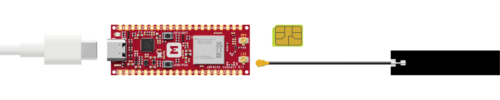
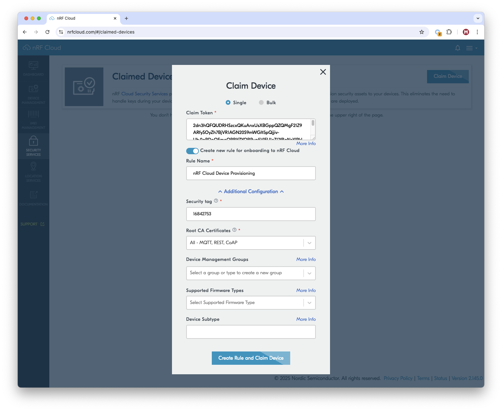
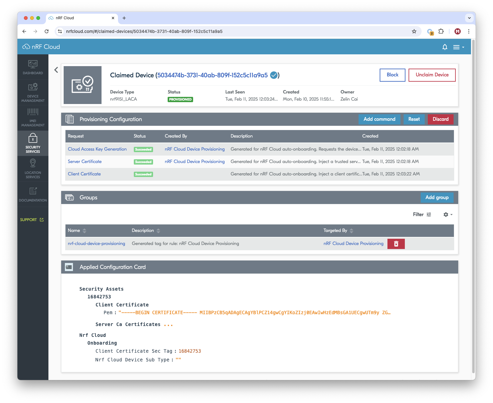

# nRF Cloud Device Provisioning

## Overview

The nRF Cloud Device Provisioning sample demonstrates how to use the [nRF Cloud device provisioning service] on the nRF9151 Connect Kit.

The sample shows how the device performs the following actions:

- Connects to nRF Cloud Provisioning Service.
- Fetches available device-specific provisioning configuration.
- Decodes the commands.
- Acts on any AT commands, if available.
- Reports the results back to the server. In the case of an error, stops processing the commands at the first error and reports it back to server.
- Sends `FINISHED` response if all the previous commands are executed without errors provided and `FINISHED` is one of the set provisioning commands.

## Requirements

Before you start, check that you have the required hardware and software:

- 1x [nRF9151 Connect Kit](https://makerdiary.com/products/nrf9151-connectkit)
- 1x nano-SIM card with LTE-M or NB-IoT support
- 1x U.FL cabled LTE-M/NB-IoT/NR+ Flexible Antenna (included in the box)
- 1x USB-C Cable
- A computer running macOS, Ubuntu, or Windows 10 or newer

## Don't have an nRF Cloud account?

To connect your device and use nRF Cloud services, you must create an nRF Cloud account:

1. Go to the [nRF Cloud] portal and click __Register__.
2. Enter your email address and choose a password.
3. Click __Create Account__.
4. Check for a verification email from nRF Cloud.

	!!! Tip
		If you do not see the verification email, check your junk mail folder for an email from `no-reply@verificationemail.com`.

5. Copy the six-digit verification code and paste it into the registration dialog box.

	!!! Tip
		If you accidentally closed the registration dialog box, repeat Step 1 and click __Already have a code?__. Enter your email address and verification code.

You can now log in to the nRF Cloud portal with your email and password. After logging in, you can see the __Dashboard__ view that displays your device count and service usage.

## Set up your board

1. Insert the nano-SIM card into the nano-SIM card slot.
2. Attach the U.FL cabled LTE-M/NB-IoT/NR+ Flexible Antenna.
3. Connect the nRF9151 Connect Kit to the computer with a USB-C cable.



## Building the sample

To build the sample, follow the instructions in [Getting Started Guide] to set up your preferred building environment.

Use the following steps to build the [nRF Cloud Device Provisioning] sample on the command line.

1. Open a terminal window.

2. Go to `NCS-Project/nrf9151-connectkit` repository cloned in the [Getting Started Guide].

3. Build the sample using the `west build` command, specifying the board (following the `-b` option) as `nrf9151_connectkit/nrf9151/ns`.

	``` bash
	west build -p always -b nrf9151_connectkit/nrf9151/ns samples/nrf_provisioning
	```

	The `-p` always option forces a pristine build, and is recommended for new users. Users may also use the `-p auto` option, which will use heuristics to determine if a pristine build is required, such as when building another sample.

	!!! Note
		This sample has Cortex-M Security Extensions (CMSE) enabled and separates the firmware between Non-Secure Processing Environment (NSPE) and Secure Processing Environment (SPE). Because of this, it automatically includes the [Trusted Firmware-M (TF-M)].

4. After building the sample successfully, the firmware with the name `merged.hex` can be found in the `build` directory.

## Flashing the firmware

[Set up your board](#set-up-your-board) before flashing the firmware. You can flash the sample using `west flash`:

``` bash
west flash
```

!!! Tip
	In case you wonder, the `west flash` will execute the following command:

	``` bash
	pyocd load --target nrf91 --frequency 4000000 build/merged.hex
	```

## Testing

After programming the sample, test it by performing the following steps:

1. Open up a serial terminal, specifying the correct serial port that your computer uses to communicate with the nRF9151 SiP:

	=== "Windows"

		1. Start [PuTTY].
		2. Configure the correct serial port and click __Open__:

			

	=== "macOS"

		Open up a terminal and run:

		``` bash
		screen <serial-port-name> 115200
		```

	=== "Ubuntu"

		Open up a terminal and run:

		``` bash
		screen <serial-port-name> 115200
		```

2. Press the __DFU/RST__ button to reset the nRF9151 SiP.

3. Wait for the LTE link to be established. You should see the output, similar to what is shown in the following:

	``` { .txt .no-copy linenums="1" title="Terminal" }
	All pins have been configured as non-secure
	Booting TF-M v2.1.0
	[Sec Thread] Secure image initializing!
	TF-M Float ABI: Hard
	Lazy stacking enabled

	[00:00:00.541,412] <inf> nrf_provisioning_sample: Establishing LTE link ...
	[00:01:26.375,061] <inf> nrf_provisioning: Provisioning new certificate
	uart:~$
	[00:02:21.829,528] <inf> nrf_provisioning_sample: Modem connection restored
	[00:02:21.839,080] <inf> nrf_provisioning_sample: Waiting for modem to acquire network time...
	[00:02:24.850,982] <inf> nrf_provisioning_sample: Network time obtained
	[00:02:25.033,386] <inf> nrf_provisioning: Checking for provisioning commands in 3s seconds
	[00:02:28.044,403] <inf> nrf_provisioning_sample: Provisioning started
	[00:02:28.159,698] <inf> nrf_provisioning_http: Requesting commands
	[00:02:36.961,242] <inf> nrf_provisioning_http: Connected
	[00:02:36.969,207] <inf> nrf_provisioning_http: No more commands to process on server side
	[00:02:36.980,072] <inf> nrf_provisioning_sample: Provisioning stopped
	[00:02:36.989,227] <inf> nrf_provisioning: Checking for provisioning commands in 86402s seconds
	uart:~$
	```

4. Type `nrf_provisioning token` command and press the Enter key ++enter++ to get the device’s attestation token.

5. Log in to the [nRF Cloud] portal. Claim the board by performing the following steps:

	1. Select __Security Services__ -> __Claimed Devices__.
	2. Click the __Claim Device__ button. A pop-up opens.
	3. Leave the default type __Single__ selected.
	4. Paste the attestation token into the __Claim Token__ field.
	5. Select __Create new rule for onboarding to nRF Cloud__ so it is toggled on. This enables auto-onboarding and creates a rule that you can use later to onboard additional devices. Creating a rule also adds an associated provisioning group.
	6. Change the name of the rule, if desired.
	7. The default security tag for the nRF Cloud samples is `16842753`. Leave this default value as is for initial onboarding.
	8. Leave the default __Root CA Certificates__ option __All__ selected. This allows the device to use both CoAP and MQTT/REST to connect to nRF Cloud.
	9. The __Device Management Groups__, __Supported Firmware Types__, and __Device Subtype__ fields are optional. You can leave them blank.
	10. Click the __Create Rule and Claim Device__ button.

	

	The device is now claimed and ready to use the nRF Cloud Provisioning Service. It appears in the Claimed Devices list in a provisioning group for the newly created rule.

6. To enforce the connection to the provisioning service, press the __DFU/RST__ button to reset the nRF9151 SiP.

7. Verify in the terminal that the device checks for provisioning commands and runs them. You should see the output, similar to what is shown in the following:

	``` { .txt .no-copy linenums="1" title="Terminal" }
	All pins have been configured as non-secure
	Booting TF-M v2.1.0
	[Sec Thread] Secure image initializing!
	TF-M Float ABI: Hard
	Lazy stacking enabled

	[00:00:00.541,442] <inf> nrf_provisioning_sample: Establishing LTE link ...
	[00:01:21.382,537] <inf> nrf_provisioning: Checking for provisioning commands in 3s seconds
	[00:01:24.393,554] <inf> nrf_provisioning_sample: Provisioning started
	[00:01:24.507,537] <inf> nrf_provisioning_http: Requesting commands
	[00:01:32.932,800] <inf> nrf_provisioning_http: Connected
	[00:01:32.943,847] <inf> nrf_provisioning_http: Processing commands
	[00:01:33.546,997] <inf> nrf_provisioning: Disconnected from network - provisioning paused
	[00:02:26.529,174] <inf> nrf_provisioning: Disconnected from network - provisioning paused
	[00:02:29.311,004] <inf> nrf_provisioning: Connected; home network - provisioning resumed
	[00:02:29.321,838] <inf> nrf_provisioning_sample: Modem connection restored
	[00:02:29.331,390] <inf> nrf_provisioning_sample: Waiting for modem to acquire network time...
	[00:02:32.343,444] <inf> nrf_provisioning_sample: Network time obtained
	[00:02:32.352,874] <inf> nrf_provisioning_http: Sending response to server
	[00:02:35.658,569] <inf> nrf_provisioning_http: Requesting commands
	[00:02:38.420,654] <inf> nrf_provisioning_http: Connected
	[00:02:38.431,701] <inf> nrf_provisioning_http: Processing commands
	[00:02:39.059,326] <inf> nrf_provisioning: Disconnected from network - provisioning paused
	[00:03:31.971,496] <inf> nrf_provisioning: Disconnected from network - provisioning paused
	[00:03:36.402,374] <inf> nrf_provisioning: Connected; home network - provisioning resumed
	[00:03:36.413,208] <inf> nrf_provisioning_sample: Modem connection restored
	[00:03:36.422,729] <inf> nrf_provisioning_sample: Waiting for modem to acquire network time...
	[00:03:39.434,692] <inf> nrf_provisioning_sample: Network time obtained
	[00:03:39.443,969] <inf> nrf_provisioning_http: Sending response to server
	[00:03:42.438,201] <inf> nrf_provisioning_sample: Provisioning stopped
	[00:03:42.447,296] <inf> nrf_provisioning_sample: Provisioning done, rebooting...
	[00:03:42.801,940] <inf> nrf_provisioning: Disconnected from network - provisioning paused
	uart:~$ All pins have been configured as non-secure
	Booting TF-M v2.1.0
	[Sec Thread] Secure image initializing!
	TF-M Float ABI: Hard
	Lazy stacking enabled

	[00:00:00.520,874] <inf> nrf_provisioning_sample: Establishing LTE link ...
	[00:01:23.054,931] <inf> nrf_provisioning: Checking for provisioning commands in 3s seconds
	[00:01:26.065,979] <inf> nrf_provisioning_sample: Provisioning started
	[00:01:26.179,962] <inf> nrf_provisioning_http: Requesting commands
	[00:01:34.705,780] <inf> nrf_provisioning_http: Connected
	[00:01:34.713,775] <inf> nrf_provisioning_http: No more commands to process on server side
	[00:01:34.724,609] <inf> nrf_provisioning_sample: Provisioning stopped
	[00:01:34.733,764] <inf> nrf_provisioning: Checking for provisioning commands in 86400s seconds
	uart:~$
	```

8. After the device finishes processing provisioning commands, the device status is now shown as __`PROVISIONED`__.

	

[nRF Cloud device provisioning service]: https://docs.nordicsemi.com/bundle/ncs-latest/page/nrf/libraries/networking/nrf_provisioning.html#lib-nrf-provisioning
[nRF Cloud]: https://nrfcloud.com/
[Getting Started Guide]: ../getting-started.md
[nRF Cloud Device Provisioning]: https://github.com/makerdiary/nrf9151-connectkit/tree/main/samples/nrf_provisioning
[Trusted Firmware-M (TF-M)]: https://docs.nordicsemi.com/bundle/ncs-latest/page/nrf/security/tfm.html#ug-tfm
[PuTTY]: https://apps.microsoft.com/store/detail/putty/XPFNZKSKLBP7RJ
