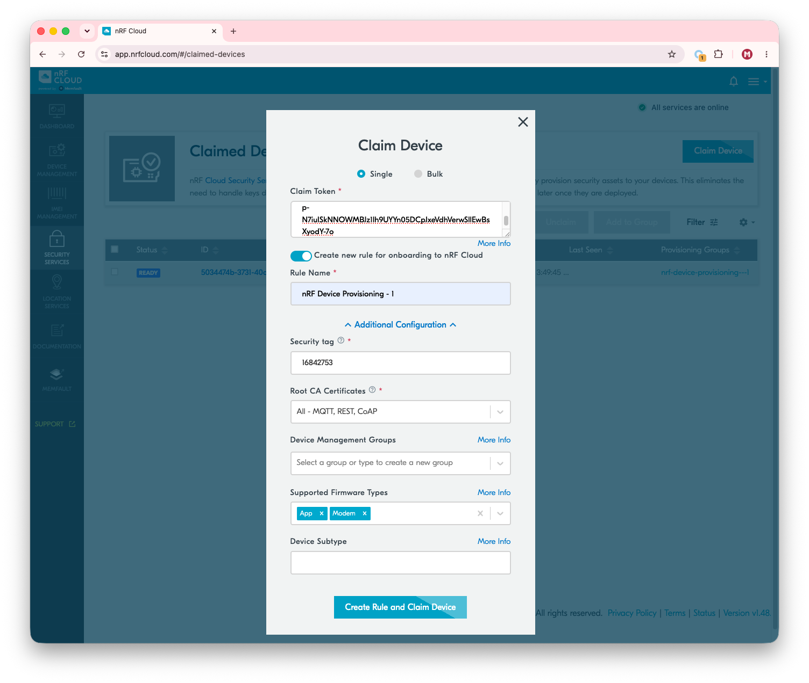
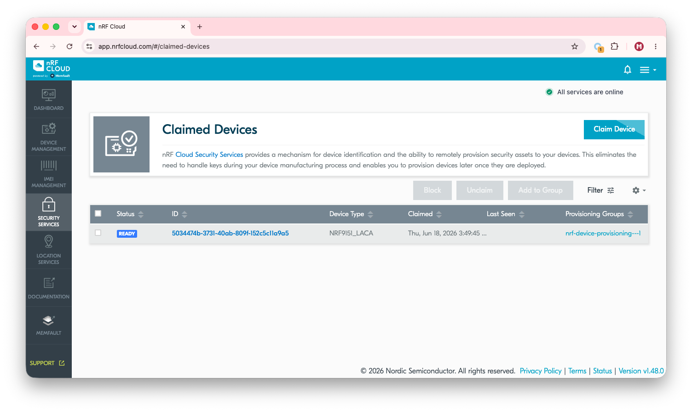
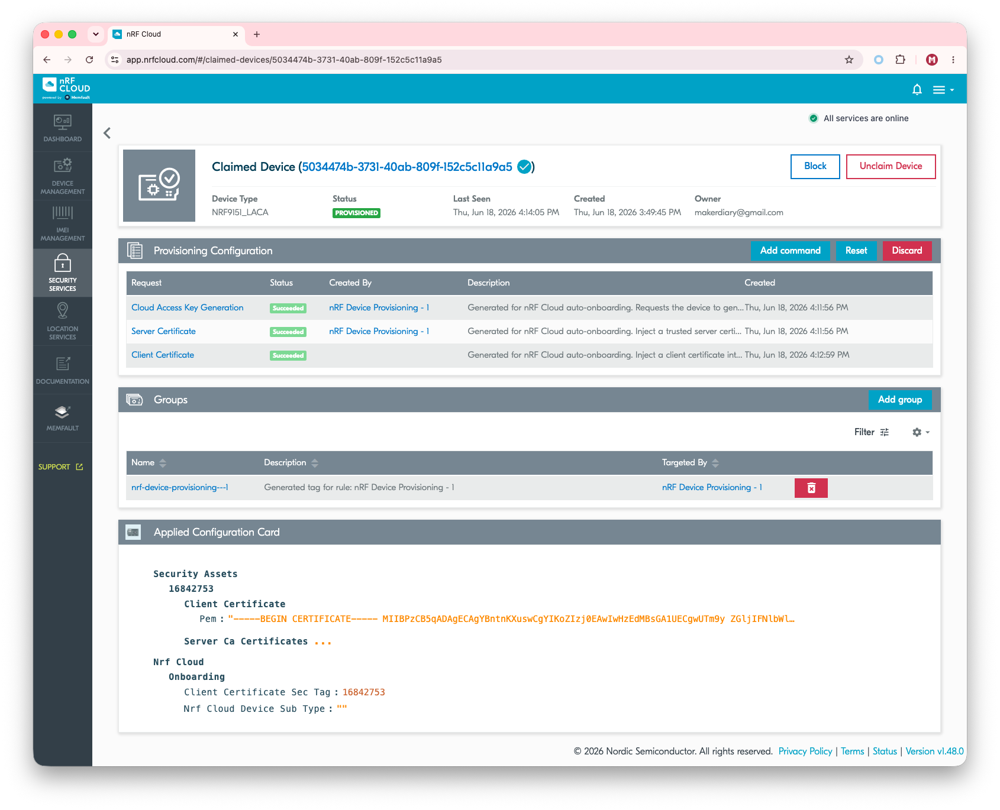

# nRF Cloud Device Provisioning

## Overview

The nRF Cloud Device Provisioning sample demonstrates how to use the [nRF Cloud device provisioning service] on the nRF9151 Connect Kit.

The sample shows how the device performs the following actions:

- Connects to the nRF Cloud Provisioning Service.
- Retrieves the device-specific provisioning configuration.
- Decodes the received commands.
- Executes any AT commands, if present.
- Reports the results back to the server. If an error occurs, stops processing further commands and reports the error to the server.
- Sends a `FINISHED` response if all commands are executed successfully and `FINISHED` is one of the provisioning commands.

## Requirements

Before you start, check that you have the required hardware and software:

- 1x [nRF9151 Connect Kit](https://makerdiary.com/products/nrf9151-connectkit)
- 1x nano-SIM card with LTE-M or NB-IoT support
- 1x U.FL cabled LTE-M/NB-IoT/NR+ Flexible Antenna (included in the box)
- 1x USB-C Cable
- A computer running macOS, Ubuntu, or Windows 10 or newer

## Don't have an nRF Cloud account?

To connect your device and use nRF Cloud services, you must create an nRF Cloud account:

1. Go to the [nRF Cloud] portal and click __Register__.
2. Enter your email address and choose a password.
3. Click __Create Account__.
4. Check for a verification email from nRF Cloud.

	!!! Tip
		If you do not see the verification email, check your junk mail folder for an email from `no-reply@verificationemail.com`.

5. Copy the six-digit verification code and paste it into the registration dialog box.

	!!! Tip
		If you accidentally closed the registration dialog box, repeat Step 1 and click __Already have a code?__. Enter your email address and verification code.

You can now log in to the nRF Cloud portal with your email and password. After logging in, you can see the __Dashboard__ view that displays your device count and service usage.

## Set up your board

1. Insert the nano-SIM card into the nano-SIM card slot.
2. Attach the U.FL cabled LTE-M/NB-IoT/NR+ Flexible Antenna.
3. Connect the nRF9151 Connect Kit to the computer with a USB-C cable.


## Building the sample

To build the sample, follow the instructions in [Getting Started Guide] to set up your preferred building environment.

Use the following steps to build the [nRF Cloud Device Provisioning] sample on the command line.

1. Open a terminal window.

2. Go to `NCS-Project/nrf9151-connectkit` repository cloned in the [Getting Started Guide].

3. Build the sample using the `west build` command, specifying the board (following the `-b` option) as `nrf9151_connectkit/nrf9151/ns`.

	``` bash
	west build -p always -b nrf9151_connectkit/nrf9151/ns samples/nrf_device_provisioning
	```

	The `-p` always option forces a pristine build, and is recommended for new users. Users may also use the `-p auto` option, which will use heuristics to determine if a pristine build is required, such as when building another sample.

	!!! Note
		This sample has Cortex-M Security Extensions (CMSE) enabled and separates the firmware between Non-Secure Processing Environment (NSPE) and Secure Processing Environment (SPE). Because of this, it automatically includes the [Trusted Firmware-M (TF-M)].

4. After building the sample successfully, the firmware with the name `tfm_merged.hex` can be found in the `build/nrf_device_provisioning/zephyr` directory.

## Flashing the firmware

[Set up your board](#set-up-your-board) before flashing the firmware. You can flash the sample using `west flash`:

``` bash
west flash
```

!!! Tip
	In case you wonder, the `west flash` will execute the following command:

	``` bash
	pyocd load --target nrf91 --frequency 4000000 build/nrf_device_provisioning/zephyr/tfm_merged.hex
	```

## Testing

After programming the sample, test it by performing the following steps:

1. Open up a serial terminal, specifying the correct serial port that your computer uses to communicate with the nRF9151 SiP:

	=== "Windows"

		1. Start [PuTTY].
		2. Configure the correct serial port and click __Open__:

			

	=== "macOS"

		Open up a terminal and run:

		``` bash
		screen <serial-port-name> 115200
		```

	=== "Ubuntu"

		Open up a terminal and run:

		``` bash
		screen <serial-port-name> 115200
		```

2. Press the __DFU/RST__ button to reset the nRF9151 SiP.

3. Wait for the LTE link to be established. You should see the output, similar to what is shown in the following:

	``` { .txt .no-copy linenums="1" title="Terminal" }
	[INF] All pins have been configured as non-secure
	[NOT] Booting TF-M v2.3.0**
	[NOT] Built Thu 18 Jun 2026 07:37:29 UTC
	[INF] Float ABI: Hard, Lazy stacking enabled

	*** Booting nRF Connect SDK v3.3.99-95ed8f7e7406 ***
	*** Using Zephyr OS v4.4.0-14033cef1f73 ***
	[00:00:00.261,352] <inf> nrf_provisioning_sample: nRF Device Provisioning Sample
	[00:00:00.261,383] <inf> nrf_provisioning_sample: Bringing network interface up and connecting to the network
	[00:00:00.263,214] <inf> nrf_provisioning_sample: Provisioning scheduled, next attempt in 3 seconds
	[00:00:03.263,366] <inf> nrf_provisioning_sample: Provisioning started
	[00:01:03.301,300] <err> nrf_provisioning: Failed to get valid modem time, err -116
	[00:01:03.301,300] <err> nrf_provisioning_sample: Provisioning failed, no valid datetime reference
	[00:01:03.301,330] <inf> nrf_provisioning_sample: Provisioning stopped
	[00:01:21.292,205] <inf> nrf_provisioning_sample: Network connectivity established
	[00:01:21.292,266] <inf> nrf_provisioning_sample: IPv4 connectivity established
	uart:~$
	```

4. Type `nrf_provisioning token` command and press the Enter key ++enter++ to get the device’s attestation token.

5. Log in to the [nRF Cloud] portal. Claim the board by performing the following steps:

	1. Select __Security Services__ -> __Claimed Devices__.
	2. Click the __Claim Device__ button. A pop-up opens.
	3. Leave the default type __Single__ selected.
	4. Paste the attestation token into the __Claim Token__ field.
	5. Select __Create new rule for onboarding to nRF Cloud__ so it is toggled on. This enables auto-onboarding and creates a rule that you can use later to onboard additional devices. Creating a rule also adds an associated provisioning group.
	6. Change the name of the rule, if desired.
	7. The default security tag for the nRF Cloud samples is `16842753`. Leave this default value as is for initial onboarding.
	8. Leave the default __Root CA Certificates__ option __All__ selected. This allows the device to use both CoAP and MQTT/REST to connect to nRF Cloud.
	9. The __Device Management Groups__, __Supported Firmware Types__, and __Device Subtype__ fields are optional. You can leave them blank.
	10. Click the __Create Rule and Claim Device__ button.

	

	The device is now claimed and ready to use the nRF Cloud Provisioning Service. It appears in the Claimed Devices list in a provisioning group for the newly created rule.

	

6. To enforce the connection to the provisioning service, press the __DFU/RST__ button to reset the nRF9151 SiP. You may encounter the following error:

	``` { .txt .no-copy linenums="1" title="Terminal" }
	...
	[00:01:03.301,300] <err> nrf_provisioning: Failed to get valid modem time, err -116
	[00:01:03.301,300] <err> nrf_provisioning_sample: Provisioning failed, no valid datetime reference
	[00:01:03.301,330] <inf> nrf_provisioning_sample: Provisioning stopped
	[00:01:21.292,205] <inf> nrf_provisioning_sample: Network connectivity established
	[00:01:21.292,266] <inf> nrf_provisioning_sample: IPv4 connectivity established
	uart:~$
	```

7. If this occurs, you can attempt to manually trigger provisioning by running the following command:

	``` { .txt .no-copy linenums="1" title="Terminal" }
	uart:~$ nrf_provisioning now
	```

8. Verify in the terminal that the device checks for provisioning commands and runs them. You should see the output, similar to what is shown in the following:

	``` { .txt .no-copy linenums="1" title="Terminal" }
	uart:~$ nrf_provisioning now
	[00:16:17.445,739] <inf> nrf_provisioning_sample: Provisioning started
	[00:16:17.548,370] <inf> nrf_provisioning_http: Requesting commands
	[00:16:24.692,932] <inf> nrf_provisioning_http: Connected
	[00:16:24.693,206] <inf> nrf_provisioning_http: Processing commands
	[00:16:24.694,671] <inf> nrf_provisioning_sample: nRF Provisioning requires device to deactivate network
	[00:16:24.952,514] <inf> nrf_provisioning_sample: Network connectivity lost
	[00:16:25.644,683] <inf> nrf_provisioning_sample: nRF Provisioning requires device to activate network
	[00:17:22.307,312] <inf> nrf_provisioning_sample: Network connectivity established
	[00:17:22.307,342] <inf> nrf_provisioning_sample: IPv4 connectivity established
	[00:17:24.685,302] <inf> nrf_provisioning_http: Sending response to server
	[00:17:27.440,917] <inf> nrf_provisioning_http: Requesting commands
	[00:17:29.953,186] <inf> nrf_provisioning_http: Connected
	[00:17:29.953,430] <inf> nrf_provisioning_http: Processing commands
	[00:17:29.954,589] <inf> nrf_provisioning_sample: nRF Provisioning requires device to deactivate network
	[00:17:30.388,488] <inf> nrf_provisioning_sample: Network connectivity lost
	[00:17:31.131,988] <inf> nrf_provisioning_sample: nRF Provisioning requires device to activate network
	[00:18:27.238,311] <inf> nrf_provisioning_sample: Network connectivity established
	[00:18:27.238,342] <inf> nrf_provisioning_sample: IPv4 connectivity established
	[00:18:29.178,466] <inf> nrf_provisioning_http: Sending response to server
	[00:18:31.713,684] <inf> nrf_provisioning_http: Requesting commands
	[00:18:34.051,818] <inf> nrf_provisioning_http: Connected
	[00:18:34.052,093] <inf> nrf_provisioning_http: Processing commands
	[00:18:34.053,558] <inf> nrf_provisioning_sample: nRF Provisioning requires device to deactivate network
	[00:18:34.455,139] <inf> nrf_provisioning_sample: Network connectivity lost
	[00:18:34.576,354] <inf> nrf_provisioning_sample: nRF Provisioning requires device to activate network
	[00:19:31.988,952] <inf> nrf_provisioning_sample: Network connectivity established
	[00:19:31.989,013] <inf> nrf_provisioning_sample: IPv4 connectivity established
	[00:19:34.617,065] <inf> nrf_provisioning_http: Sending response to server
	[00:19:36.902,282] <inf> nrf_provisioning_sample: Provisioning done
	[00:19:36.902,313] <inf> nrf_provisioning_sample: The device can now connect to the provisioned cloud service
	[00:19:36.902,343] <inf> nrf_provisioning_sample: Provisioning stopped
	[00:19:36.902,404] <inf> nrf_provisioning_sample: Provisioning scheduled, next attempt in 62 seconds
	```

9. After the device finishes processing provisioning commands, the device status is now shown as __`PROVISIONED`__.

	

[nRF Cloud device provisioning service]: https://docs.nordicsemi.com/bundle/ncs-latest/page/nrf/libraries/networking/nrf_provisioning.html#lib-nrf-provisioning
[nRF Cloud]: https://nrfcloud.com/
[Getting Started Guide]: ../getting-started.md
[nRF Cloud Device Provisioning]: https://github.com/makerdiary/nrf9151-connectkit/tree/main/samples/nrf_device_provisioning
[Trusted Firmware-M (TF-M)]: https://docs.nordicsemi.com/bundle/ncs-latest/page/nrf/security/tfm.html#ug-tfm
[PuTTY]: https://apps.microsoft.com/store/detail/putty/XPFNZKSKLBP7RJ
