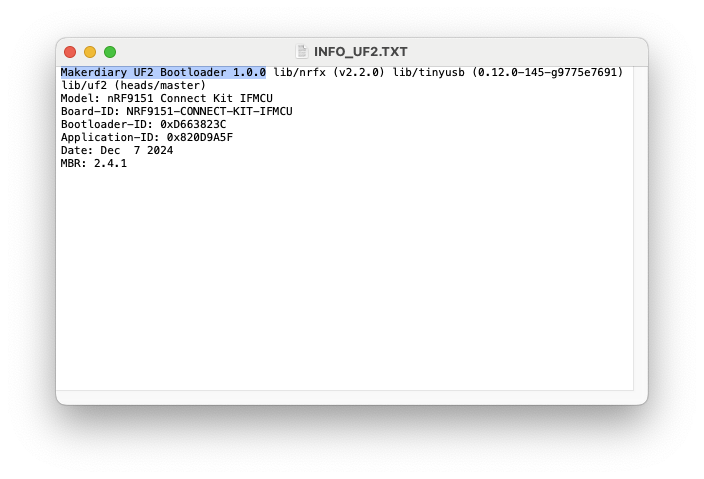
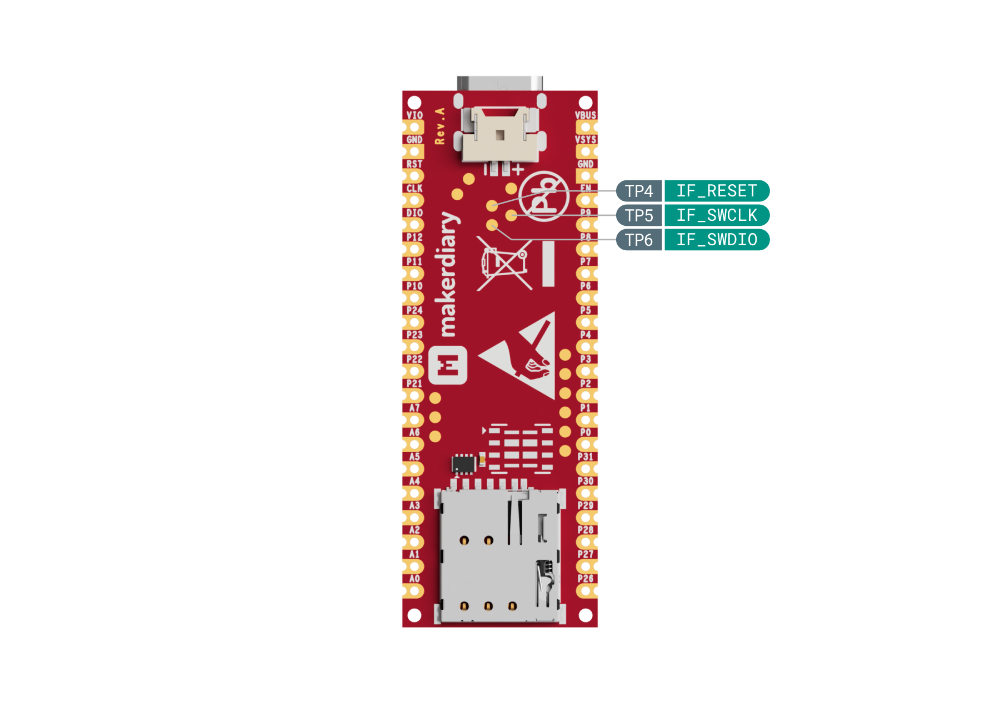

# Update the Interface MCU Firmware

## Overview

This guide describes how you can update the application firmware and bootloader of the Interface MCU on the nRF9151 Connect Kit.

## Requirements

Before you start, check that you have the required hardware and software:

- 1x [nRF9151 Connect Kit](https://makerdiary.com/products/nrf9151-connectkit)
- 1x USB-C Cable
- A computer running macOS, Ubuntu, or Windows 10 or newer

## Update the application firmware

The application firmware is compatible with the UF2 Bootloader, so that you can easily update the firmware by just copying the .uf2-format file to the flash drive without using an external programmer.

!!! Tip
	The pre-built firmware will be published on [GitHub Releases]. Alternatively, you may build your own firmware by completing the steps in the [Interface MCU Firmware] documentation. 

To update the firmware, complete the following steps:

1. Push and hold the __DFU/RST__ button and connect your board to the USB port of your computer. Release the __DFU/RST__ button after your board is connected.

2. It will mount as a Mass Storage Device called __UF2BOOT__. The RGB LED is breathing in red.

3. Drag and drop .uf2-format file onto the __UF2BOOT__ volume. The RGB LED blinks red rapidly during programming.

4. The application starts running after the firmware programming is completed.

!!! Note
	You may experience the following errors when copying the firmware to the __UF2BOOT__ drive on __macOS 14.5 or newer__:

	<div class="grid" markdown>

	

	``` { .bash .no-copy linenums="1" title="Terminal" }
	$ cp build/ifmcu_firmware/zephyr/zephyr.uf2 /Volumes/UF2BOOT
	cp: /Volumes/UF2BOOT/zephyr.uf2: fcopyfile failed: Input/output error
	cp: /Volumes/UF2BOOT/zephyr.uf2: fchmod failed: No such file or directory
	```

	</div>

	Currently you can ignore these errors as the firmware programming is completed and the application should work as expected.

## Update the UF2 Bootloader

The UF2 Bootloader is self-upgradable, and you can simply update the bootloader by just copying the .uf2-format file to the flash drive without using an external programmer.

!!! Tip
	The pre-built bootloader will be published on [GitHub Releases] with the name `update-nrf9151_connectkit_nrf52820_uf2boot-<version>.uf2`.


To update the bootloader, complete the following steps:

1. Push and hold the __DFU/RST__ button and connect your board to the USB port of your computer. Release the __DFU/RST__ button after your board is connected.

2. It will mount as a Mass Storage Device called __UF2BOOT__. The RGB LED is breathing in red.

3. Open `INFO_UF2.TXT` in the __UF2BOOT__ volume with a text editor, and check the current version of bootloader. The figure below shows we are running the `1.0.0` version.

	


4. Drag and drop a newer .uf2-format bootloader onto the __UF2BOOT__ volume. The RGB LED blinks red rapidly during programming.

5. The new bootloader starts running after the firmware programming is completed.
6. Re-enter the UF2 Bootloader mode, and verify the version printed in `INFO_UF2.TXT`.

!!! Note
	You may experience the following errors when copying the firmware to the __UF2BOOT__ drive on __macOS 14.5 or newer__:

	<div class="grid" markdown>

	

	``` { .bash .no-copy linenums="1" title="Terminal" }
	$ cp build/ifmcu_firmware/zephyr/zephyr.uf2 /Volumes/UF2BOOT
	cp: /Volumes/UF2BOOT/zephyr.uf2: fcopyfile failed: Input/output error
	cp: /Volumes/UF2BOOT/zephyr.uf2: fchmod failed: No such file or directory
	```

	</div>

	Currently you can ignore these errors as the firmware programming is completed and the application should work as expected.

## Recovery from a broken UF2 Bootloader

If your device fails to enter the bootloader mode, you may need to perform a recovery from a broken UF2 bootloader. To re-program the UF2 Bootloader, an external debug probe is needed.

!!! Tip
	The pre-built bootloader will be published on [GitHub Releases] with the name `nrf9151_connectkit_nrf52820_uf2boot-<version>.hex`.

The SWD port of Interface MCU (nRF52820) is exposed on the bottom of the board. Note that the signal voltage levels of SWD should match to __VDD_GPIO__.

The following figure illustrates the SWD port of the Interface MCU (nRF52820):



[GitHub Releases]: https://github.com/makerdiary/nrf9151-connectkit/releases
[Interface MCU Firmware]: ../ncs/applications/ifmcu.md
