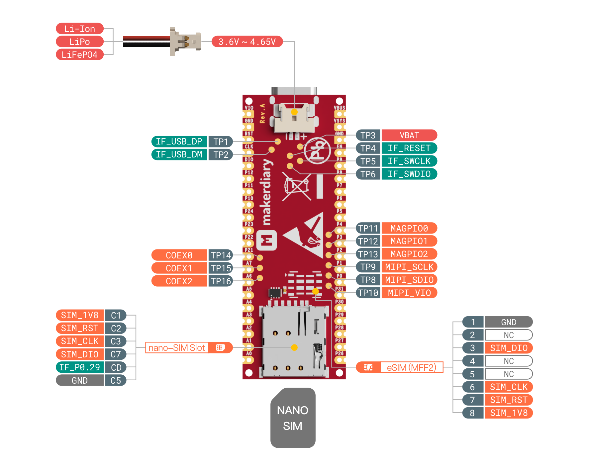

# Hardware description

This section of the documentation specifies and describes the nRF9151 Connect Kit mainly from a hardware point of view.

## Hardware diagram

The following figure illustrates the nRF9151 Connect Kit hardware diagram. The design has loose or pre-soldered pin headers available.

[][HW Diagram PDF]

[][HW Diagram PDF]

## Mechanical dimensions

nRF9151 Connect Kit is a 4-layer chem. Gold, 55.88mm x 20.32mm (2.2" x 0.8") 1mm thick PCB with a USB Type-C port, a battery connector, a nano-SIM card slot and 40x castellated/through-hole pins.

[:material-folder-download: Download DXF Files][Board DXF Files]

## Power supply

nRF9151 Connect Kit can be powered through the USB-C port, a Li-Ion/LiPo/LiFePO4 battery, or by an external power source. The board contains a [BQ25180] I2C programmable battery charger with power path management and ultra low
quiescent current, and a [TPS63901] buck-boost converter with 75-nA quiescent current and 1.8V/3.3V configurable power supply for I/Os.

The following figure describes the power supply architecture:

!!! Warning "Applying an external power source at VBUS"

	If the USB-C port is not going to be used, it is safe to apply an external power source at __VBUS__. However, if the USB-C port is in use, the __VBUS__ pin should NOT be powered by any external power source. Otherwise it may damage the USB port or the external power source. 

## Interface MCU

nRF9151 Connect Kit features an on-board Interface MCU built using the nRF52820, which has CMSIS-DAP support to enable programming, debug as well as modem firmware update without using any external tools. The Interface MCU also includes a USB-UART bridge for log, trace and terminal emulation, and an Interface Shell bundled with helpful commands to access the board-specific functionality.

The following figure describes the functional architecture of the Interface MCU:

The following table describes the pin functions of the Interface MCU:

| Pin name | Description |
|----------|-------------|
| P0.0     | GPIO pin used for SWCLK output. Connect to the SWCLK pin of nRF9151 SiP. |
| P0.1     | GPIO pin used for SWDIO input/output. Connect to the SWDIO pin of nRF9151 SiP. |
| P0.2     | SDA pin of the I2C bus. Connect to the SDA pin of BQ25180 through a 10-kΩ pullup resistor. |
| P0.3     | SCL pin of the I2C bus. Connect to the SCL pin of BQ25180 through a 10-kΩ pullup resistor. |
| P0.4/RX  | RXD pin of the UART bridge. Connect to the P0.11 pin of nRF9151 SiP. |
| P0.5/TX  | TXD pin of the UART bridge. Connect to the P0.12 pin of nRF9151 SiP. |
| P0.7     | GPIO pin used for RESET output. Connect to the RESET pin of nRF9151 SiP. |
| P0.8     | GPIO pin used to select the voltage of __VDD_GPIO__. Connect to the SEL pin of TPS63901 through a 1-MΩ pulldown resistor. Selects 1.8V when a high level is applied to this pin. Selects 3.3V when a low level is applied to this pin. |
| P0.14    | GPIO pin used to control the Blue LED of RGB LED driven by a MOS switch. A high level applied to this pin turns on the LED and a low level turns it off. |
| P0.15    | GPIO pin used to control the Green LED of RGB LED driven by a MOS switch. A high level applied to this pin turns on the LED and a low level turns it off. |
| P0.16    | GPIO pin used to control the Green LED driven by a MOS switch. A high level applied to this pin turns on the LED and a low level turns it off. |
| P0.17    | GPIO pin used to control the TS/MR pin of BQ25180. TS/MR is driven by a MOS switch and pulls to GND when A high level applied to this pin. |
| P0.20    | GPIO pin used to control the Red LED of RGB LED driven by a MOS switch. A high level applied to this pin turns on the LED and a low level turns it off. |
| P0.28    | GPIO pin connected to the /INT pin of BQ25180. When a fault occurs, a 128-μs active low pulse is sent out to this pin as an interrupt. |
| P0.29    | GPIO pin used to detect the nano-SIM card inserting. This pin pulls to GND when no card is inserted. |
| P0.30    | GPIO pin used to detect button press of the DFU/RST button. This pin pulls to GND when the button is pressed. |

## General purpose I/Os

There are up to 31 multi-function General Purpose I/Os (8 can be configured as ADC inputs) available on the header pins. These GPIOs are powered from the __VDD_GPIO__ rail which is 1.8V or 3.3V configurable. Any GPIO can be mapped to a digital peripheral (such as SPI, UART, TWI, PDM, I2S and PWM) for layout flexibility.

The following figure illustrates the GPIOs pinout:

## Buttons

nRF9151 Connect Kit has two on-board push-buttons, one labeled with __USR/P25__ is connected to the __`P0.25`__ of nRF9151 SiP, the other labeled with __DFU/RST__ is connected to the __`P0.30`__ of the Interface MCU (nRF52820).

The following table describes the function of the buttons:

| Button      | GPIO                                  | Description |
|-------------|---------------------------------------|-------------|
| __USR/P25__     | P0.25 :material-arrow-right: nRF9151  | User programmable push-button controlled by nRF9151. The P0.25 pin pulls to GND when the button is pressed |
| __DFU/RST__ | P0.30 :material-arrow-right: nRF52820 | This push-button is controlled by nRF52820 and its behavior depends on the Interface MCU firmware.   The P0.30 pin pulls to GND when the button is pressed.   Push and hold this button and then power up the board, the board will run into the Interface MCU UF2 Bootloader Mode.   In Interface MCU Normal Mode, pushing this button resets the nRF9151 SiP. |

## LEDs

nRF9151 Connect Kit has one Green LED and one RGB LED that are controlled by dedicated GPIOs of the Interface MCU (nRF52820). Each LED is driven by a MOS switch and powered from the __VSYS__ rail. A high level applied to the GPIO pin turns on the LED and a low level turns it off.

The following figure shows the connection and behavior of each LED:

| LED             | GPIO                                 | Description |
|-----------------|--------------------------------------|-------------|
| Green LED       | P0.16 :material-arrow-left: nRF52820 | Indicates the __VBUS__ power state. Stays on (solid) when the power is good. |
| RGB LED - Red   | P0.20 :material-arrow-left: nRF52820 | In Interface MCU UF2 Bootloader Mode, this LED blinks fast when updating the firmware, and breathes slow when in idle state.  In Interface MCU Normal Mode, it blinks fast when any UART bridge transmission is enabled, and stays off when in idle state. |
| RGB LED - Green | P0.15 :material-arrow-left: nRF52820 | Indicates the battery charging status. Breathes slow when the battery is charging. Stays off when charging is complete or when charging is disabled.   If no battery is connected, the indication will switch between charging status and charging done status. |
| RGB LED - Blue  | P0.14 :material-arrow-left: nRF52820 | Indicates the DAP transmission state. It blinks fast when any DAP transmission is enabled, and stays off when in idle state. |

## SIM and eSIM

nRF9151 Connect Kit supports a SIM card. It has a pluggable SIM card socket that is compatible with a nano-sized SIM (4FF). The board also has an unpopulated eSIM (MFF2) footprint that can be populated with a compatible eSIM IC.

The following figure illustrates the nano-SIM socket and eSIM footprint:

!!! Warning "Only one SIM is supported"
    Using the nano-SIM socket is the default. If an eSIM is soldered onto the board, the nano-SIM socket should be left unused.

## LTE/DECT NR+ RF interface

nRF9151 Connect Kit has a U.FL receptacle for the external LTE-M/NB-IoT/NR+ antenna. Included with the kit is a U.FL cabled LTE-M/NB-IoT/NR+ flexible antenna. The antenna is optimized for global operation, supporting all LTE frequency bands in the region of 698 MHz to 960 MHz and 1710 MHz to 2200 MHz.

The following figure shows how to attach the LTE-M/NB-IoT/NR+ flexible antenna:

## GNSS RF interface

nRF9151 Connect Kit has a U.FL receptacle for the external GNSS antenna. Included with the kit is a U.FL cabled GNSS antenna. The signal from the GNSS antenna is amplified by a Low-Noise Amplifier (LNA) before being fed to the GNSS RF port of the nRF9151 SiP. The LNA is powered by a ultra-low IQ (25 nA typ.) LDO ([TPS7A02228]) that is controlled by the nRF9151 SiP __`COEX0`__ pin. With 18.2 dB gain and only 0.7 dB noise figure it ensures high system sensitivity.

The following figure shows the GNSS circuitry:

The following figure shows how to attach the GNSS antenna:

!!! Tip "Optimize GNSS reception"

	* GNSS signals do not usually penetrate ceilings or other structures that well. For best GNSS performance, the antenna should be placed outside on a flat surface in an open space far from sources of interference and other structures that can block the satellite signals.
	* The GNSS patch antenna achieves the highest gain when placed horizontally on a surface (x-y) facing the z-axis since it can receive all propagated GNSS signals. A lower gain is experienced if the patch antenna is mounted at an angle.

## Debug interface

nRF9151 Connect Kit supports Arm Serial Wire Debug (SWD) port, which makes it possible to connect external debuggers for debug and programming. Note that the signal voltage levels of SWD should match to __VDD_GPIO__.

The following figure illustrates the SWD port of the nRF9151 SiP:

!!! Warning "Connect the external debugger to nRF9151"

	The SWD port of nRF9151 is default connected to the Interface MCU's DAP interface. If an external debugger is wired to the SWD port of nRF9151, the Interface MCU's DAP interface should be disabled.

The SWD port of Interface MCU (nRF52820) is also available for use. Note that the signal voltage levels of SWD should match to __VDD_GPIO__.

The following figure illustrates the SWD port of the Interface MCU (nRF52820):

## Additional pins

Additional pins are exposed on the bottom of the board for on-board functionality or external circuitry.

The following figure illustrates the additional pins:

The following table describes the pin functions of the additional pins:

| Pin  | Name      | Description |
|------|-----------|-------------|
| TP1  | IF_USB_DP | USB D+ signal of the Interface MCU (nRF52820). |
| TP2  | IF_USB_DM | USB D- signal of the Interface MCU (nRF52820). |
| TP3  | VBAT      | Battery power supply. Connect to the positive terminal of the battery. |
| TP4  | IF_RESET  | RESET pin of the Interface MCU (nRF52820). |
| TP5  | IF_SWCLK  | Serial wire debug clock input of the Interface MCU (nRF52820). |
| TP6  | IF_SWDIO  | Serial wire debug I/O of the Interface MCU (nRF52820). |
| TP8  | MIPI_SDIO | Data pin of the nRF9151's MIPI RFFE control interface. |
| TP9  | MIPI_SCLK | Clock pin of the nRF9151's MIPI RFFE control interface. |
| TP10 | MIPI_VIO  | Power pin of the nRF9151's MIPI RFFE control interface. |
| TP11 | MAGPIO0   | 1.8 V general purpose I/O of the nRF9151's MAGPIO interface. |
| TP12 | MAGPIO1   | 1.8 V general purpose I/O of the nRF9151's MAGPIO interface. |
| TP13 | MAGPIO2   | 1.8 V general purpose I/O of the nRF9151's MAGPIO interface. |
| TP14 | COEX0     | nRF9151's Coexistence interface. |
| TP15 | COEX1     | nRF9151's Coexistence interface. |
| TP16 | COEX1     | nRF9151's Coexistence interface. |

[HW Diagram PDF]: ./assets/attachments/nrf9151-connectkit-hardware-diagram_reva.pdf
[Board DXF Files]: ./assets/attachments/nrf9151-connectkit-board-dxf_reva.zip
[BQ25180]: https://www.ti.com/product/BQ25180
[TPS63901]: https://www.ti.com/product/TPS63901
[TPS7A02228]: https://www.ti.com/product/TPS7A02