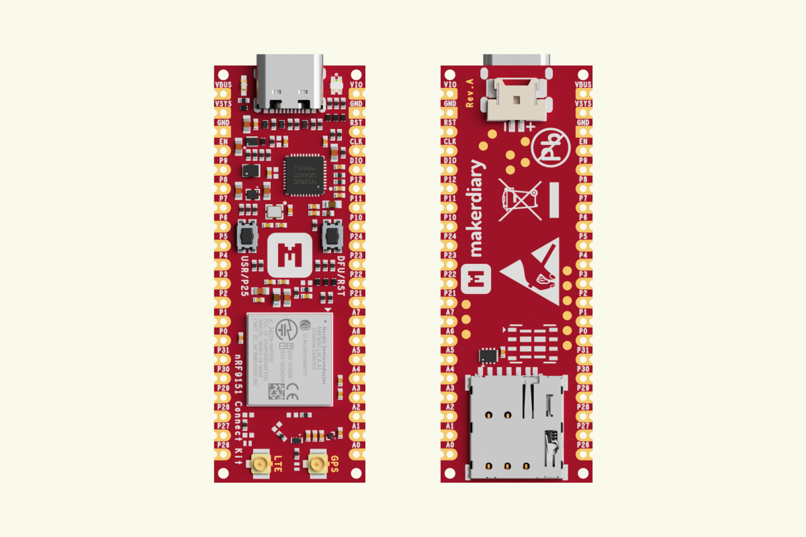
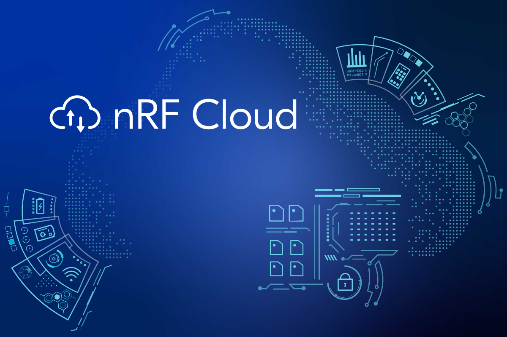
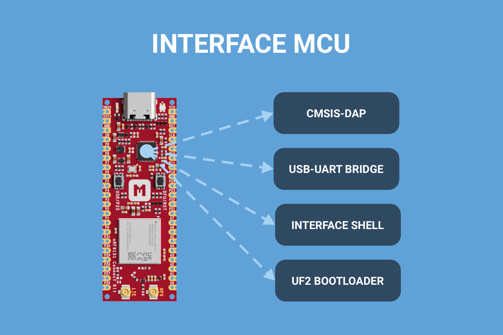

# What's new

-   [][migrating-from-a0-to-a1-revision]

    __[Migrating from A0 to A1 Revision][migrating-from-a0-to-a1-revision]__

    We are pleased to announce that the nRF9151 SiP module on the nRF9151 Connect Kit has been updated from revision A0 to A1, adding support for Non-Terrestrial Networks (NTN).

    :octicons-calendar-24: Jun 18, 2026 ・ :octicons-clock-24: 3 min read

    [migrating-from-a0-to-a1-revision]: ./blog/posts/migrating-from-a0-to-a1-revision/index.md

-   [][introducing-nrf-cloud]

    __[Introducing nRF Cloud][introducing-nrf-cloud]__

    nRF Cloud offers a suite of services optimized for Nordic ultra-low power wireless devices that supports your IoT deployment throughout its entire lifecycle.

    :octicons-calendar-24: Mar 11, 2025 ・ :octicons-clock-24: 4 min read

    [introducing-nrf-cloud]: ./blog/posts/introducing-nrf-cloud/index.md

-   [][introducing-interface-mcu]

    __[Introducing Interface MCU][introducing-interface-mcu]__

    The Interface MCU simplifies debugging and programming of the nRF9151 SiP without external tools and provides access to board-specific features.

    :octicons-calendar-24: Mar 10, 2025 ・ :octicons-clock-24: 3 min read

    [introducing-interface-mcu]: ./blog/posts/introducing-interface-mcu/index.md

[View all](./blog/index.md){ .md-button .md-button--primary }

